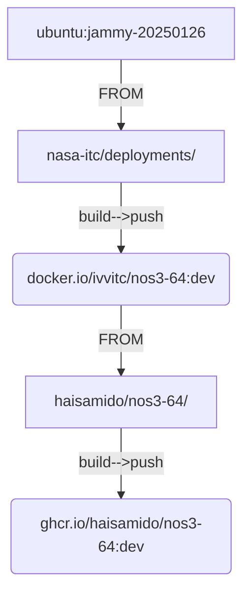
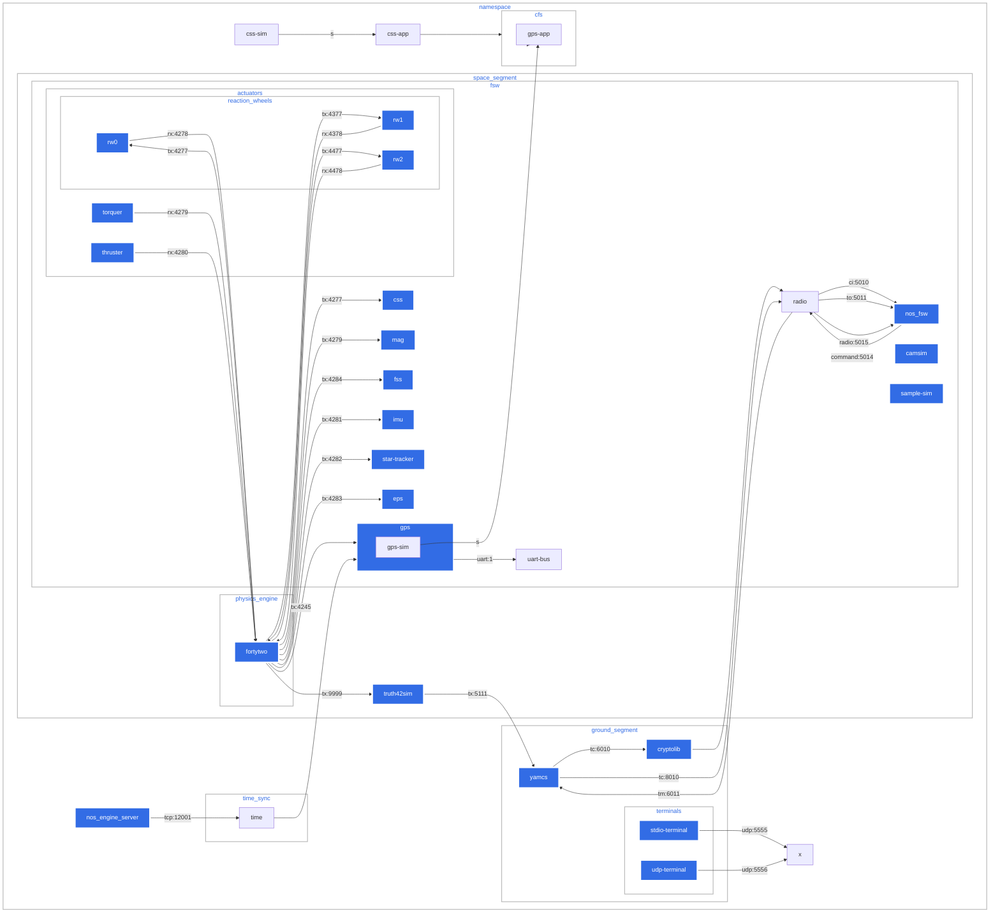

# How to use

## Dependencies

- `gnu make`
- `bash`

### Optional but very useful

- `task` a contemporary version of `make`
- `lazydocker`

Which can be installed via `make install-lazydocker install-taskfile`

## prep - onetime run

```bash
make install-lazydocker install-taskfile env-create

```

## Run `task` after you've done `make install-taskfile`:

```bash
task

```

returns:

```bash
task: Available tasks for this project:
* build:                                Build all containers
* build-fortytwo:                       Build fortytwo (42)
* build-fsw:                            Build nos3-base-local (fsw)
* build-openmct:                        Build openmct
* build-yamcs:                          Build yamcs
* check-docker-ps:                      check docker ps for any exited|unhealthy|created|error containers
* check-service-ready:                  wait for a service to be ready on a given port
* clean:                                clean nos3 configuration
* clean-containers:                     clean images, cache, volumes, and networks
* config:                               configure nos3 by running config.sh
* config-nos3-mission:                  configure nos3-mission.xml to set start-time
* default:                              Shows this help message
* down:                                 Bring down nos3
* env-create:                           Create .env file from env.sh script
* info-services:                        info on accessing various services
* install-lazydocker:                   Install lazydocker CLI tool (to view logs, etc)
* purge-containers:                     WARNING: purge docker/podman images, cache, volumes, and networks
* set-permissions:                      set filesystem permissions, needed for restricted accounts
* setup-maven:                          Setup maven settings.xml with proxy info-services
* sidecar:                              Run sidecar to enable output
* submodule-update:                     sync and update git submodules
* up:                                   Bring up nos3 in detached state
* up-minimum:                           Bring up nos3 (minimum) in detached state
* k8s:apply:deployment:                 apply nos3 kubernetes deployment(s)
* k8s:apply:ingress:nginx:              apply ingress-nginx for nos3 kubernetes
* k8s:apply:kustomization:              Apply kustomization to the namespace
* k8s:convert:kompose:                  convert docker-compose to kubernetes manifests using kompose
* k8s:convert:kompose:helm:             convert docker-compose to kubernetes manifests using kompose
* k8s:create:namespace:                 Create the Kubernetes namespace
* k8s:delete:deployment:                delete nos3 kubernetes deployment(s)
* k8s:delete:kustomization:             Delete kustomize and namespace
* k8s:delete:namespace:                 delete nos3 kubernetes namespace
* k8s:generate:all:                     Generate all kubernetes yamls for COMPONENT_NAME
* k8s:generate:configmap:args:          Generate kubernetes configmaps yaml for COMPONENT_NAME
* k8s:generate:configmap:env:           Generate kubernetes configmaps yaml for COMPONENT_NAME
* k8s:generate:configmap:volumes:       Generate kubernetes volumes configmaps yaml for COMPONENT_NAME
* k8s:generate:configmaps:all:          Generate all kubernetes yamls for COMPONENT_NAME
* k8s:generate:deployment:              Generate kubernetes deployment yaml for COMPONENT_NAME
* k8s:generate:ingress:                 Generate kubernetes configmaps yaml for COMPONENT_NAME
* k8s:generate:kustomization:           Generate Kustomization yaml for COMPONENT_NAME
* k8s:generate:service:                 Generate kubernetes service yaml for COMPONENT_NAME
* k8s:get:configmap:                    get a specific kubernetes configmaps defined in K8S_CONFIGMAP_NAME
* k8s:get:configmaps:                   get nos3 kubernetes configmaps
* k8s:get:pod-name:                     get the pod name for nos3 kubernetes deployment
* k8s:kill:port-forward:                Kill port-forward
* k8s:path:yamls:                       generate kubernetes yamls for the deployment
* k8s:port-forward:                     Port forward to access services locally
* k8s:write:env:                        write k8s env file


```

```bash
task up

```

### Taskfile

more info on `task` can be found here https://taskfile.dev

### Lazydocker

more info on `lazydocker` can be found here https://github.com/jesseduffield/lazydocker  


## Test

open http://localhost:8090/instance?c=nos3__realtime to access yamcs/gsw
open http://localhost:30090/vnc.html to access fortytwo (42)
open http://localhost:9000 to access openmct

## Diagrams

Ignore the below for now





## docker ps

```bash
docker ps | grep -v 'CONTAINER ID' |wc -l
24

```

```bash
docker ps

CONTAINER ID   IMAGE                     COMMAND                  CREATED              STATUS          PORTS                                                                                                NAMES
3a130fadaea9   ivvitc/nos3-64:20250217   "./nos3-single-simul…"   41 seconds ago       Up 40 seconds                                                                                                        nos_time_driver
9661c0fa0ac8   ivvitc/nos3-64:20250217   "./nos3-single-simul…"   49 seconds ago       Up 47 seconds                                                                                                        sc_1_torquer_sim
4ff3a142614a   ivvitc/nos3-64:20250217   "./nos3-single-simul…"   50 seconds ago       Up 47 seconds                                                                                                        sc_1_thruster_sim
277b46405250   ivvitc/nos3-64:20250217   "./nos3-single-simul…"   50 seconds ago       Up 48 seconds                                                                                                        sc_1_startrk_sim
44d1809986f5   ivvitc/nos3-64:20250217   "./nos3-single-simul…"   50 seconds ago       Up 48 seconds                                                                                                        sc_1_sample_sim
dcde3f725275   ivvitc/nos3-64:20250217   "./nos3-single-simul…"   51 seconds ago       Up 47 seconds   0.0.0.0:16010->6010/tcp, 0.0.0.0:16010->6010/udp, 0.0.0.0:16011->6011/tcp, 0.0.0.0:16011->6011/udp   sc_1_radio_sim
1e0a92b988c3   ivvitc/nos3-64:20250217   "./nos3-single-simul…"   51 seconds ago       Up 48 seconds                                                                                                        sc_1_rw_sim2
eb3bc34fcc2f   ivvitc/nos3-64:20250217   "./nos3-single-simul…"   51 seconds ago       Up 49 seconds                                                                                                        sc_1_rw_sim1
0c327e64ef4e   ivvitc/nos3-64:20250217   "./nos3-single-simul…"   52 seconds ago       Up 50 seconds                                                                                                        sc_1_rw_sim0
9c6166335f7f   ivvitc/nos3-64:20250217   "./nos3-single-simul…"   52 seconds ago       Up 50 seconds                                                                                                        sc_1_mag_sim
523b92a28e7f   ivvitc/nos3-64:20250217   "./nos3-single-simul…"   53 seconds ago       Up 50 seconds                                                                                                        sc_1_imu_sim
82dfa03e9c62   ivvitc/nos3-64:20250217   "./nos3-single-simul…"   53 seconds ago       Up 51 seconds                                                                                                        sc_1_gps_sim
af58b5d09af2   ivvitc/nos3-64:20250217   "./nos3-single-simul…"   53 seconds ago       Up 51 seconds                                                                                                        sc_1_fss_sim
42fe85609195   ivvitc/nos3-64:20250217   "./nos3-single-simul…"   54 seconds ago       Up 51 seconds                                                                                                        sc_1_eps_sim
ac7787f9cf7a   ivvitc/nos3-64:20250217   "./nos3-single-simul…"   54 seconds ago       Up 51 seconds                                                                                                        sc_1_css_sim
5aedf4c0a619   ivvitc/nos3-64:20250217   "./nos3-single-simul…"   56 seconds ago       Up 53 seconds                                                                                                        sc_1_truth42sim
0282c8fb48e2   ivvitc/nos3-64:20250217   "/usr/bin/nos_engine…"   57 seconds ago       Up 53 seconds                                                                                                        sc_1_nos_engine_server
14e98992d60b   ivvitc/nos3-64:20250217   "./support/standalone"   57 seconds ago       Up 54 seconds                                                                                                        sc_1_cryptolib
0c06e9b85d03   ivvitc/nos3-64:20250217   "/opt/neo/nos3/scrip…"   57 seconds ago       Up 53 seconds                                                                                                        sc_1_nos_fsw
1e84eafbabe1   ivvitc/nos3-64:20250217   "/opt/neo/nos3/scrip…"   58 seconds ago       Up 54 seconds                                                                                                        sc_1_onair
2365e959b0c6   ivvitc/nos3-64:20250217   "/home/neo/.nos3/42/…"   58 seconds ago       Up 55 seconds                                                                                                        sc_1_fortytwo
72c26bc3690a   ivvitc/nos3-64:20250217   "./nos3-single-simul…"   59 seconds ago       Up 58 seconds                                                                                                        nos_udp_terminal
96c8948f8b01   ivvitc/nos3-64:20250217   "./nos3-single-simul…"   59 seconds ago       Up 58 seconds                                                                                                        nos_terminal
f78f9bda0e0a   ivvitc/nos3-64:20250217   "mvn -Dmaven.repo.lo…"   About a minute ago   Up 58 seconds   0.0.0.0:5012->5012/tcp, 0.0.0.0:8090->8090/tcp                                                       cosmos_openc3-operator_1

```

## docker network list

```bash

docker network list

NETWORK ID     NAME                DRIVER    SCOPE
2a772b648d00   bridge              bridge    local
5fe825f9aaa9   docker_quickstart   bridge    local
6652439bc0af   host                host      local
8cd5a6aac2de   none                null      local
6c6e8d8284e4   nos3_core           bridge    local
cca8286b3dd6   nos3_sc_1           bridge    local

```
