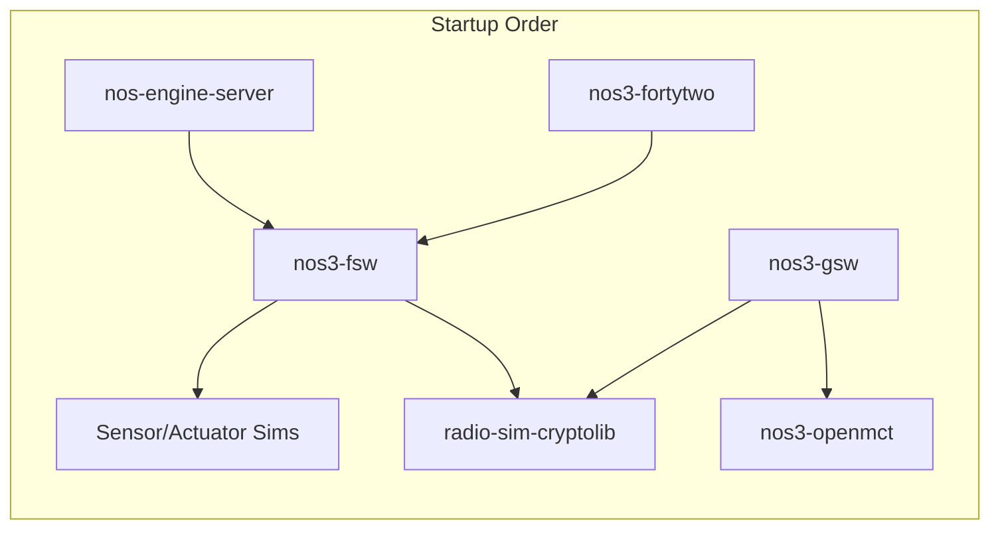

# NOS3 Data Flow Diagram

```mermaid
flowchart TB
    subgraph External["External Access"]
        User["👤 User/Browser"]
    end

    subgraph GroundSoftware["Ground Software"]
        YAMCS["nos3-gsw<br/>(YAMCS)<br/>:8090, :5012"]
        OpenMCT["nos3-openmct<br/>:9000, :8080"]
    end

    subgraph FlightSoftware["Flight Software"]
        FSW["nos3-fsw<br/>(cFS Flight Software)"]
        OnAir["nos3-onair<br/>(On-Air Launch)"]
    end

    subgraph SimulationCore["Simulation Core"]
        FortyTwo["nos3-fortytwo<br/>(42 Simulator)<br/>:30090"]
        NosEngine["nos3-nos-engine-server<br/>:12000, :12001"]
        Time["nos3-time<br/>(Time Driver)"]
        Truth42["nos3-truth42sim"]
    end

    subgraph Terminals["Terminals & Bridges"]
        Terminal["nos3-nos-terminal<br/>(STDIO Terminal)"]
        UDPTerminal["nos3-nos-udp-terminal<br/>(UDP Terminal)"]
        SimBridge["nos3-nos-sim-bridge<br/>(Command Bus Bridge)"]
    end

    subgraph SensorSimulators["Sensor Simulators"]
        CSS["nos3-css-sim<br/>(Coarse Sun Sensor)"]
        FSS["nos3-fss-sim<br/>(Fine Sun Sensor)"]
        GPS["nos3-gps-sim"]
        IMU["nos3-imu-sim"]
        MAG["nos3-mag-sim<br/>(Magnetometer)"]
        StarTrk["nos3-startrk-sim<br/>(Star Tracker)"]
        CAM["nos3-camsim<br/>(Camera)"]
    end

    subgraph ActuatorSimulators["Actuator Simulators"]
        RW0["nos3-rw-sim0<br/>(Reaction Wheel 0)"]
        RW1["nos3-rw-sim1<br/>(Reaction Wheel 1)"]
        RW2["nos3-rw-sim2<br/>(Reaction Wheel 2)"]
        Thruster["nos3-thruster-sim"]
        Torquer["nos3-torquer-sim"]
    end

    subgraph OtherSims["Other Simulators"]
        EPS["nos3-eps-sim<br/>(Power System)"]
        Sample["nos3-sample-sim"]
        RadioCrypto["nos3-radio-sim-cryptolib<br/>(Radio + CryptoLib)"]
    end

    %% User Access
    User -->|":8090 YAMCS Web"| YAMCS
    User -->|":9000/:8080 OpenMCT"| OpenMCT
    User -->|":30090 42 VNC"| FortyTwo

    %% Ground to Flight Communication
    OpenMCT -->|"Telemetry API"| YAMCS
    YAMCS <-->|"Commands/Telemetry<br/>via RadioCrypto"| RadioCrypto
    RadioCrypto <-->|"Encrypted Comms"| FSW

    %% Core Dependencies
    FSW -->|"depends_on"| FortyTwo
    FSW -->|"depends_on"| NosEngine
    Time -->|"depends_on"| NosEngine
    Truth42 -->|"depends_on"| NosEngine

    %% NOS Engine as central hub
    NosEngine <-->|"Time Sync"| Time
    NosEngine <-->|"Simulation Bus"| FSW
    NosEngine <-->|"42 Data"| Truth42

    %% 42 Simulator provides environment data
    FortyTwo -->|"Spacecraft State<br/>(Position, Attitude)"| Truth42
    FortyTwo -->|"Sun Vector"| CSS
    FortyTwo -->|"Sun Vector"| FSS
    FortyTwo -->|"Orbit/Position"| GPS
    FortyTwo -->|"Angular Rates"| IMU
    FortyTwo -->|"Magnetic Field"| MAG
    FortyTwo -->|"Star Field"| StarTrk
    FortyTwo -->|"Scene Data"| CAM
    FortyTwo -->|"Solar Power"| EPS

    %% Sensor data to FSW
    CSS -->|"Sensor Data"| FSW
    FSS -->|"Sensor Data"| FSW
    GPS -->|"Sensor Data"| FSW
    IMU -->|"Sensor Data"| FSW
    MAG -->|"Sensor Data"| FSW
    StarTrk -->|"Sensor Data"| FSW
    CAM -->|"Sensor Data"| FSW
    EPS -->|"Power Status"| FSW
    Sample -->|"Sample Data"| FSW

    %% FSW commands to actuators
    FSW -->|"Wheel Commands"| RW0
    FSW -->|"Wheel Commands"| RW1
    FSW -->|"Wheel Commands"| RW2
    FSW -->|"Thrust Commands"| Thruster
    FSW -->|"Torque Commands"| Torquer

    %% Actuator feedback to 42
    RW0 -->|"Torque Applied"| FortyTwo
    RW1 -->|"Torque Applied"| FortyTwo
    RW2 -->|"Torque Applied"| FortyTwo
    Thruster -->|"Thrust Applied"| FortyTwo
    Torquer -->|"Torque Applied"| FortyTwo

    %% Terminals
    SimBridge <-->|"Command Bus"| FSW
    Terminal <-->|"Debug I/O"| NosEngine
    UDPTerminal <-->|"UDP Debug"| NosEngine

    %% Styling
    classDef ground fill:#4a90d9,stroke:#2c5282,color:#fff
    classDef flight fill:#48bb78,stroke:#276749,color:#fff
    classDef simcore fill:#ed8936,stroke:#c05621,color:#fff
    classDef sensor fill:#9f7aea,stroke:#6b46c1,color:#fff
    classDef actuator fill:#f56565,stroke:#c53030,color:#fff
    classDef terminal fill:#718096,stroke:#4a5568,color:#fff
    classDef other fill:#38b2ac,stroke:#285e61,color:#fff
    classDef external fill:#ecc94b,stroke:#b7791f,color:#000

    class YAMCS,OpenMCT ground
    class FSW,OnAir flight
    class FortyTwo,NosEngine,Time,Truth42 simcore
    class CSS,FSS,GPS,IMU,MAG,StarTrk,CAM sensor
    class RW0,RW1,RW2,Thruster,Torquer actuator
    class Terminal,UDPTerminal,SimBridge terminal
    class EPS,Sample,RadioCrypto other
    class User external
```

## NOS3 Architecture Overview

The diagram shows the **NASA Operational Simulator for Small Satellites (NOS3)** system with these key data flows:

### Core Components

| Component | Purpose | Ports |
|-----------|---------|-------|
| **nos3-fortytwo** | 42 Spacecraft Dynamics Simulator | :30090 (VNC) |
| **nos3-nos-engine-server** | Central simulation bus | :12000, :12001 |
| **nos3-fsw** | cFS Flight Software | - |
| **nos3-gsw (YAMCS)** | Ground Software/Mission Control | :8090, :5012 |
| **nos3-openmct** | Web-based telemetry visualization | :9000, :8080 |

### Data Flow Patterns

1. **Environment → Sensors**: 42 Simulator provides spacecraft state data (sun vectors, magnetic field, star field, etc.) to sensor simulators

2. **Sensors → FSW**: Sensor simulators send telemetry to the Flight Software

3. **FSW → Actuators**: Flight Software sends commands to reaction wheels, thrusters, and torquers

4. **Actuators → Environment**: Actuator responses feed back to 42 Simulator to update spacecraft dynamics

5. **FSW ↔ Ground**: Radio simulator with CryptoLib handles encrypted communication between flight and ground software

### Networks

All services connect to both Docker networks:
- **nos3-core**: Core infrastructure network
- **nos3-sc01**: Spacecraft 01 network

### Service Dependencies

### Sensor Simulators

| Simulator | Description |
|-----------|-------------|
| **nos3-css-sim** | Coarse Sun Sensor |
| **nos3-fss-sim** | Fine Sun Sensor |
| **nos3-gps-sim** | GPS Receiver |
| **nos3-imu-sim** | Inertial Measurement Unit |
| **nos3-mag-sim** | Magnetometer |
| **nos3-startrk-sim** | Star Tracker |
| **nos3-camsim** | Camera |

### Actuator Simulators

| Simulator | Description |
|-----------|-------------|
| **nos3-rw-sim0/1/2** | Reaction Wheels (3-axis control) |
| **nos3-thruster-sim** | Thruster |
| **nos3-torquer-sim** | Magnetic Torquer |

### Other Simulators

| Simulator | Description |
|-----------|-------------|
| **nos3-eps-sim** | Electrical Power System |
| **nos3-sample-sim** | Sample/Payload Simulator |
| **nos3-radio-sim-cryptolib** | Radio with encryption (CryptoLib) |
| **nos3-time** | Time synchronization driver |
| **nos3-truth42sim** | Ground truth from 42 |
