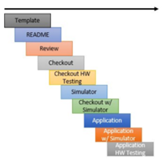

# Components

NOS3 is organized around the foundational concept of a component.
The intent is that a spacecraft be made up of a core set of common functionality and then a custom set of components.  
Each component is represented by a FSW application which is placed in an `fsw` subdirectory of the component.
In order for the ground software to control the component application, a component has a collection of command and telemetry tables which are placed in a `gsw` subdirectory of the component.
In many cases (but not all), a component is a hardware component on the spacecraft and thus it is appropriate to have a NOS3 hardware simulator for the component which is placed in a `sims` subdirectory of the component.

## Generic Components

NOS3 provides a baseline set of generic components in order to provide an example reference mission on which to build and develop additional tools and technologies.

### Component Information

High level reference information has been compiled for the various components.
Note that it is assumed telemetry messages are also within range, but just follow the form 0x0XXX opposed to 0x1XXX for command MIDs.

* Camera - Arducam
  * Protocol(s): I2C and SPI
  * MSGID range: 0x18C8 - 0x18CA
  * Perf_IDs: 105, 106  
* Coarse Sun Sensors (CSS)
  * Protocol(s): I2C
  * MSGID range: 0x1910 - 0x1911
  * Perf_IDs: 600, 601
* Electrical Power System (EPS)
  * Protocol(s): I2C
  * MSGID range: 0x191A - 0x191B
  * Perf_IDs: 401
* Fine Sun Sensors (FSS)
  * Protocol(s): SPI
  * MSGID range: 0x1920 - 0x1921
  * Perf_IDs: 510, 511
* Global Positioning System (GPS) - Novatel OEM615
  * Protocol(s): streaming UART
  * MSGID range: 0x1870 - 0x1871
  * Perf_IDs: 48
* Inertial Measurement Unit (IMU)
  * Protocol(s): CAN
  * MSGID range: 0x1925 - 0x1926
  * Perf_IDs: 530, 531
* Magnetometer
  * Protocol(s): SPI
  * MSGID range: 0x192A - 0x192B
  * Perf_IDs: 540, 541
* Radio
  * Protocol(s): Sockets
  * MSGID range: 0x1930 - 0x1931
  * Perf_IDs: 520
* Reaction Wheel
  * Protocol(s): UART
  * MSGID range: 0x1992 - 0x1993
  * Perf_IDs: 77
* Sample
  * Protocol(s): UART
  * MSGID range: 0x18FA - 0x18FB
  * Perf_IDs: 500
* Star Tracker
  * Protocol(s): SpaceWire
  * MSGID range: 0x1935 - 0x1936
  * Perf_IDs: 550
* Torquers
  * Protocol(s): PWM via HWLIB's TRQ commands
  * MSGID range: 0x193A - 0x193B
  * Perf_IDs: 505
* Thrusters
  * Protocol(s):  UART
  * MSGID range: 0x18EA - 0x18EB
  * Perf IDs: 508

### Component Development

* Template Generation  
  * The development of a new component starts with using the template generator provided by NOS3. This template establishes a standard format and structure for the component, ensuring consistency and combability with the rest of the framework.  
* Component Documentation Review 
  * Review and update the documentation for the component to provide comprehensive information about the software interface between the hardware component and flight software. The component readme should include details on the document and versions utilized during development and a comprehensive test plan. It is recommended to have another developer or team member to review the documentation and ensure its completeness and accuracy.  
* Standalone Checkout Application Development 
  * Develop a standalone checkout application that serves as a test environment for the component. This application can be built to run in the NOS3 simulation or on a development board.  
* Hardware and Flight Software Integration 
  * In cases where hardware availability is delayed, the development of the flight software application can procced using the same functions and hardware library calls used in the standalone checkout application. This approach ensures that the flight software application primarily serves as an integration test with the rest of the software components, including the ground software and associated integration tests documented in the test plan. Note that the simulation is not a replacement for traditional hardware testing, but an additional tool to be used to reduce schedule and risk.  
* Component Updates and Refinements 
  * Once hardware testing becomes possible, additional time should be allocated to update the component based on insights and findings from the testing from the hardware testing phase. This includes making necessary adjustments within the NOS3 framework to ensure proper functionality and performance.  
* Generic Components
  * These components provide a standardized starting point for building simulations and training materials. By including generic components, NOS3 can showcase standard commands, telemetry, and interfaces to potential users who are not familiar with the underlying software modules. 
  * The generic components in NOS3 ensures that the framework remains adaptable, flexible, and relevant to a wide range of small satellite missions. It empowers developers and mission teams to leverage existing components as building blocks and focus their efforts on specific mission requirements and optimizations, rather than starting from scratch.   

## Integrated Algorithms

TODO
...

### Attitude Determination and Control System (ADCS)
* Protocol(s): N/A
* MSGID range: 0x1940 - 0x194F
* Perf_IDs: 777

### CryptoLib
* Protocol(s): N/A
* MSGID range: 0x1915 - 0x1916

CryptoLib provides a software-only solution using the CCSDS Space Data Link Security Protocol - Extended Procedures (SDLS-EP) to secure communications between a spacecraft flight software and ground station.
CryptoLib was originally designed as a Core Flight System (cFS) spacecraft library but has recently expanded in scope to become more generic and support telecommand encryption using gcrypt. 

To get started with CryptoLib, you can visit the [GitHub repository](https://github.com/nasa/CryptoLib/wiki#what-is-cryptolib) maintained by NASA.
The documentation provides detailed information on usage, configuration, and testing.

[Cryptolib ReadTheDocs](https://nasa-cryptolib.readthedocs.io/en/latest/)

### OnAir

OnAir is a free and open source framework developed by Dr. Evana Gizzi, Dr. James Marshall, and a team at the NASA  Goddard Space Flight Center (GSFC) that allows the running of an AI model utilizing flight data.
This can be done offline with CSV and other formats, but it's ability to use the Software Bus Network (SBN) cFS app, and its C/Python bridge client (SBN_Client) are utilized to integrate it into NOS3, so a user can configure packets to feed from the cFS Software Bus into OnAIR running a Python-based AI model in real time. 
Currently, the system is configured to only read a basic Sample App packet as a proof of concept; however, with some reconfiguration, a user may feed any packets into a custom model with the system

In order to configure OnAIR to utilize a specific packet or parameter, it must be defined within OnAIR, and then subscribed to with SBN.
To define a packet in SBN, go to  `nos3\components\onair\message_headers.py` and replicate the structs for your desired packets in a method similar to that displayed.
Then, go to `nos3\components\onair\cfs_sample_tlm.json` and enter the headers there, along with the proper Message ID and packet info at the bottom.
The information you need for this should be found in each particular app or component's msgids.h, msg.h, app.h and/or device.h.
This should be all the configuration necessary, as the Message ID provided in the cfs_sample_tlm.json (or equivalent) file should be passed to SBN and SBN_Client, which should both auto-subscribe to the packet internally.
This can be verified by checking for a matching data stream in your OnAIR window.

In order to utilize these packets properly, you'd need to build a plugin in OnAIR, which would utilize the structs you created to pass on the telemetry values you are collecting for you to use.
You'd then set up your AI model, choose what telemetry you wish to be parameters, set it up, and run it.
However, the details are beyond the scope of this guide, and could likely be found either in OnAIR's documentation, or that for whatever AI Library you choose to use (TensorFlow, Keras, Scikit, PyTorch, etc). 

### Synopsis
* Protocol(s):
* MSGID range: 0x18FC - 0x18FD
* Perf_IDs: 560
