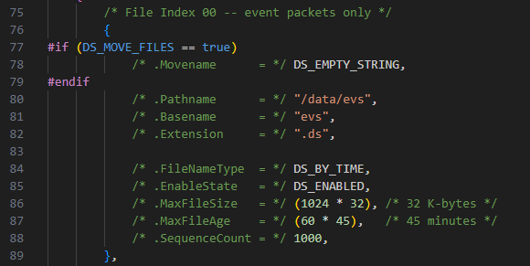
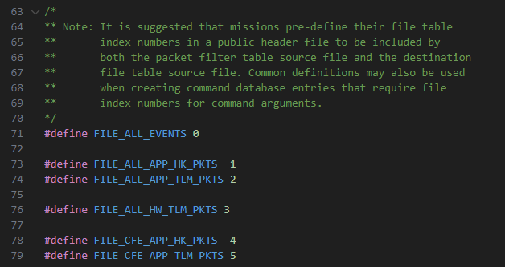
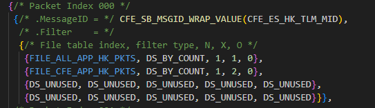
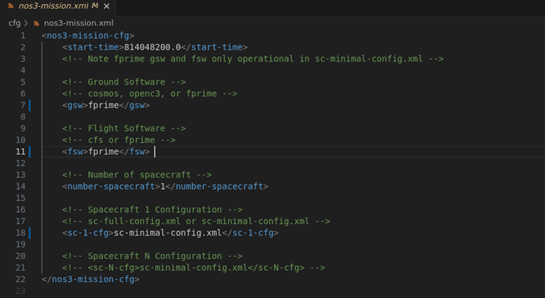
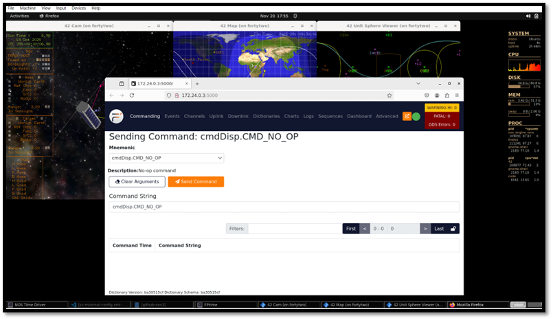
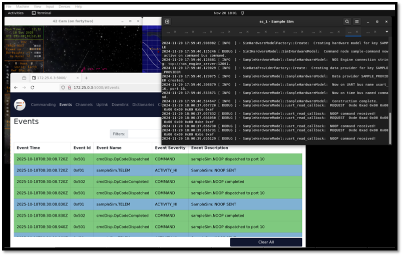

# Flight Software

Flight Software (FSW) is responsible for operating and navigating your spacecraft throughout its mission. NOS3 creates an environment that allows a user to simulate and end-to-end mission with a spacecraft using cFS. NOS3 Flight software is defaulted to use cFS, however F' FSW is integrated into NOS3 as well to provide another FSW system for users to explore.

## Standalone Checkout
In NOS3, Standalone Checkouts are used to verify component functionality with your Components Simulation. Following the steps below will create a simple terminal interface to interact with the Simulation. Checkouts are to be used to test your component without connecting your component to NOS3 in its entirety, therefore providing a proof of concept of operations.

The below example is a reference for the sample component.

To build the standalone version, assuming starting from top level NOS3 repository:
* make debug
* cd ./components/sample/support
* mkdir build
* cd build
* cmake .. 
  * Can override target selection by adding `-DTGTNAME=cpu1`
* make

To run the standalone version, assuming starting rom the top level NOS3 repository:
* Follow the build steps above
* make
* make checkout
  * Launches NOS Engine, NOS Time Driver, NOS Terminal, Sample Sim, and Sample Checkout
* make stop

## core Flight System (cFS)

A little `c` because it's a small core - cFS is the default for NOS3.
This section will describe the method utilized to interface NOS3 with cFS.

### Operating System Abstraction Layer

Core Flight System is the FSW selected for the STF-1 mission partially due to the implementation of the Operating System Abstraction Layer (OSAL). The OSAL provides an API that allows flight software applications to be written without operating system (OS) specific calls. When cFS is compiled, the target OS is specified and the build system includes the proper libraries. This allows the FSW written for the FreeRTOS target to be built to execute on Linux and the opposite remains true. This makes NOS3 an ideal development environment when using the OSAL Linux target.

### Platform Support Package

In addition to the OSAL, cFS includes a Platform Support Package (PSP) that includes libraries that are not OS specific, but can be reused for a specific flight board, such as memory, clocks, timers, etc. The PSP used for NOS3 is a modified version of the Linux PSP release. In order to control timing in flight software, cFS uses multiple timers, the main being a 1 Hz timer tick. By replacing the 1 Hz timer provided by Linux with the NOS Engine time ticker we can sync the time from the PSP with the time that other NOS3 components are running.

### Hardware Library

The third component of flight software implemented for hardware abstraction is a hardware library (HWLIB). The HWLIB is used for component specific I/O calls, such as I2C, UART, etc. The hardware library includes a single header file, typically provided as drivers from the on-board computer (OBC) manufacturer, that defines the I/O function calls. When building cFS, the CMAKE build system then selects the driver source corresponding to the target being built.

### cFS Heritage Applications
High level reference information has been compiled for the various cFS Applications.
Note that it is assumed telemetry messages are also within range without the 0x1XXX indicating a command.
* cf - CCSDS File Delivery Protocol
  * Protocol(s): CFDP and UDP
  * MSGID range: 0x18B3 - 0x18B5 
  * Perf_ID ranges: 11-20, 30+x, 40+x
* ci - Command Injest
  * Protocol(s): CCSDS and UDP
  * MSGID range: 0x1884-0x1887
  * Perf_IDs: 0x0070, 0x0071
* ci_lab - Command Injest Lab
  * Protocol(s): CCSDS and UDP
  * MSGID range: 0x18E0-0x18E1
  * Perf_IDs: 32, 33  
* ds - Data Storage
  * Protocol(s): CCSDS
  * MSGID range: 0x18BB-0x18BC
  * Perf_IDs: 38
* fm - File Manager
  * Protocol(s): CCSDS
  * MSGID range: 0x188C - 0x188D
  * Perf_IDs: 39, 44
* hwlib - Hardware Library
  * Protocol(s): CCSDS
  * MSGID range: N/A
  * Perf_IDs: 50
* lc - Limit Checker
  * Protocol(s): CCSDS
  * MSGID range: 0x18A4-0x18A6
  * Perf_IDs: 28, 43
* sc - Stored Commands
  * Protocol(s): CCSDS
  * MSGID range: 0x18A9-0x18AB
  * Perf_IDs: 37
* sch - Scheduler
  * Protocol(s): CCSDS
  * MSGID range: 0x1895-0x1897
  * Perf_IDs: 36
* to - Telemetry Output
  * Protocol(s): CCSDS
  * MSGID range: 0x1880-0x1882
  * Perf_IDs: 0x0072
* to_lab - Telemetry Output Lab
  * Protocol(s): CCSDS
  * MSGID range: 0x18E8-0x18E9
  * Perf_IDs: 34, 35

## cFS Tables

Several cFS Apps rely on tables to configure them. The main ones that are preconfigured by NOS3 are the ones for cf, ds, fm, hk, sc, sch, and to. The main ones the user would likely want to configure for their mission and the ds, sc, and sch tables.

### DS Tables
DS, or Data Storage, utilizes three main tables - the File Table, the Filter Table, and the Indices table. The Indices table can likely be left as default in most cases, leaving the File and Filter tables as the main ones you would likely want to reconfigure.

The DS File Table is defined at {nos3_base}/cfg/nos3_defs/tables/ds_file_table.c. It handles the definition of files for the data storage app, which allow the logging of user-defined sets of packets from the cFS Bus to a file which can be saved off by the user for analysis. By default, 4 files are fully created and two more are semi-defined, and it allows for a maximum of 16 files (indexed 0-15).

The user should start by picking an unused index, and creating a #define in the list at the top aliasing the index number of their file with its name.



The image above is the default event packet log file for NOS3, and shows the following file attributes which the user can define. 
* Movename allows you to define a path where you want the file to be moved and stored on simulator shutdown. 
* Pathname is the relative path within the spacecraft's base storage at which you want the file to be created (the spacecraft's files are found at '{nos3_base}/fsw/build/exe/cpu1').
* Basename sets the base filename of the file
* Extension sets the file extension for the file (".ds" by default)
* FileNameType defines whether you are rolling the file (and thus extending the filename) by time or count.
* EnableState defines if the file starts out as enabled or disabled. If enabled, it will collect data from simulation start. If disabled, the user must manually activate it using a command before it starts collecting data
* MaxFileSize defines the max size of a file before it is rolled (in bytes by default, so multiples of 1024 increase to KB, MB, GB, etc)
* MaxFileAge defines the max age of a file before it is rolled (in seconds)
* SequenceCount is only used if rolling by count. Otherwise can be left as DS_UNUSED. If used, will define the starting count for the file

Once the user defines all attributes as desired, the user should go to {nos3_base}/scripts/docker_launch.sh, and after line 32 should add a `mkdir` command like the ones above it with any new data directory in which they plan to spawn their file. If they are spawning it in an already extant directory, this can be skipped. Then, once this is done the file should be created on startup, though it will not accrue data unless the Filter Table has already been configured to send packets to it.

The DS Filter Table is used to define what packets DS should send to what files to be stored. Initially, only the small subset of packets stored in the default files are defined, but the user can both add more packets, and define what tables new and existing packets should be sent to.

First, you should add a #define matching the one you added to the file table to alias the index of your table to its name, so that you can use your name later on, as shown here:



Then, the user will want to edit the entry for a packet. There are 256 slots for packets (indexed 0-255), of which 15 are defined by default. Below is an example of what one of these entries looks like:



The entries are structured as follows:

* MessageID is the MID of the packet you wish to add. These can be found within the [app]_msgids.h files found in each app's source code. These should already be linked into the build structure for DS, so further files should not need to be added. To add a new packet, simply find the MID you wish to add, and replace `CFE_SB_MSGID_RESERVED` in an unused entry with your desired MID wrapped within `CFE_SB_MSGID_WRAP_VALUE()`, as seen in the example image.
* The Filter contains the entries for what files you wish to forward that packet to for storage. It contains an entry for each file, structured as follows: 
  * The index of your file, as defined in the `#define` step above.
  * The filter type (generally by count, so that you are collecting each packet generated)
  * N, which is the numerator of the ratio of packets to store by sequence number
  * X, which is the denominator of the ratio of packets to store by sequence number
  * O, which is the offset, defining the sequence number of the first packet to store
  So, for example, N = 1, X = 1, O = 0 would store every packet starting at the 0th index, while N = 1, X = 2, O = 2 would store every other packet starting at the 6th packet

Once you have defined all your new packets and storage parameters, then as long as your file table and directories are properly created, your file should start populating with all the right packets upon startup. 

### SC RTS Tables
RTS Tables are utilized by the SC - or Stored Command - app to allow users to set up sequences of commands that can be triggered via a single set of commands from the ground. 

TODO
...
Details on RTS Tables

## F' 

(Courtesy of <https://nasa.github.io/fprime/>)

F´ (or F Prime) is a software framework for the rapid development and deployment of embedded systems and spaceflight applications. 
Originally developed at NASA’s Jet Propulsion Laboratory, F´ is open-source software that has been successfully deployed for several space applications. 
It has been used for but is not limited to, CubeSats, SmallSats, instruments, and deployables.

F´ has the following features:
* Component architecture with well-defined interfaces
* C++ framework providing core capabilities like queues, threads, and operating-system abstraction
* Tools for designing systems and automatically generating code from systems design
* A standard library of flight-worthy components
* Testing tools for unit and system-level testing

### Configuring NOS3 to Use F-Prime:

When Building NOS3 with F-Prime, it may be necessary to clone NOS3 in a
Linux environment, rather than attempt to build with shared folders. You
can use the NOS3 VM and clone NOS3 in **/home/jstar/,** rather than use
the github-nos3 shared folder in the NOS3 VMs Desktop. Building F-Prime
with shared folders can sometimes result in build errors due to the
shared folder, however building locally inside the Linux environment
will ensure NOS3 builds successfully.

When Configuring NOS3 to use F-Prime. Be sure to edit the
nos3-mission.xml file to select F-Prime as your GSW and FSW as seen
above. After changing you mission configuration, save the file and run
**make clean** from your nos3/ directory. Run **make** to rebuild NOS3
for the F-Prime FSW and GSW configuration. Once NOS3 is built, run
**make launch** and wait for the F-Prime gds window to launch. Below is
a picture of the NOS3 Configuration needed to build F-Prime.



Note, if a NOS3 user wishes to add fidelity to F-Prime. The user must
**make clean** to remove autogenerated files so that F-Prime can be
built again. Once NOS3 is cleaned, simply run make to rebuild F-Prime
FSW with new additions.

### Sending a Sample NOOP Command:

After the F-Prime GDS window launches, F-Prime FSW should be running and
the Sample component can be commanded. To send a SampleSim noop command,
select the SampleSim.NOOP command from the drop down menu in the F-Prime
GDS. You will then seen the noop command Completed event message under
the events tab in the F-Prime GDS window. You will also see the command
process in the SampleSim terminal window in NOS3. The below figures
represent an example of what commanding looks like in the F-Prime GDS.





### Creating an F-Prime Component in NOS3:

To create a NOS3 component in NOS3, first enter the nos3 debug by
running **make debug** in the nos3/ directory.

After running make debug, navigate to the
**fsw/F-Prime/F-Prime-nos3/Components** directory.

Here you can create a new F-Prime component by running the following
command: **F-Prime-util new –component**

Note, you do not need to run the F-Prime virtual python environment in
order to use the F-Prime framework tools to create an F-Prime project.
NOS3 has included the F-Prime tools inside its docker container which is
why the make debug is used to generate the new component in F-Prime.

For more information on how to create F-Prime projects, components,
deployments, etc. You can see the F-Prime documentation found here:
[https://nasa.github.io/F-Prime/](https://nasa.github.io/fprime/)

The Helloworld tutorial helps a user understand how to use F-Prime and
how to get started with developing using the F-Prime FSW framework. This
tutorial explains how to setup an F-Prime project, however a user can
use the existing F-Prime project found in NOS3. That is F-Prime-nos3/
which is found under **fsw/F-Prime/**. The Helloworld tutorial also
describes how to create basic F-Prime connections to launch a new
component in the F-Prime-gds.

The Nos3 Developers were able to utilize NOS3 Component fidelity to
communicate to simulations in NOS3 without having to start from scratch
in F-Prime. For example, with the sample component in Nos3, the
developers were ablet to include the necessary NOS3 libraries and files
in the F-Prime cmake files in the Component/ and Deployment/
directories. This allows F-Prime to pull in the necessary function calls
from NOS3 to F-Prime fsw. For an example refer to the Sample component
in F-Prime, you will see how commanding is setup in the F-Prime
component by utilizing the existing NOS3 fideltiy.

It is important to understand that each component has its own cmake
file, so when creating new components based of NOS3 Components, you need
to be sure you are including the necessary files from the NOS3 Component
directory. Also, each file you share with F-Prime in the F-Prime
Component, you need to share with the F-Prime Deployment. There are two
cmake files in the Deployment directory

### F-Prime NOS3 Time Component (Nos3Time):

Here we explain how we synchronize time from NOS3 to with F-Prime by
creating our own passive F-Prime component. This component can be found
under fsw/F-Prime/F-Prime-nos3/Components. There you will find the cpp
and fpp files that make up the Nos3Time component in F-Prime. These
files are explained in more detail below.

 

Starting with Nos3Time.cpp, we establish a couple functions in F-Prime
to successfully retrieve NOS3 Time and sync that data for F-Prime FSW.

NOS Engine supplies time on a created bus interface.

The interface is created with the following nos engine connection string:
```
“tcp://nos\_engine\_server:12000”
```

 

This describes the type of connection, where the connection is being
made, and on which port. This string is used when creating our Fprime Bus in the Nos3Time.cpp.


Following this, users need to set up a Buse Name, a TICKS\_PER\_SECOND
variable. These will allow for the connection of a component to this bus
via a call-back function which will provide NOS Engine time on each tick
being populated in the above created bus. This is accomplished using a
NOS Engine create bus command, and the add call back command:

 
```
NE\_create\_bus(hub, ENGINE\_BUS\_NAME, ENGINE\_SERVER\_URI);

NE\_bus\_add\_time\_tick\_callback(F-Prime\_Bus,
F-Prime\_NosTickCallback);
```

 

A callback function should look similar to the following:

 
```
void F-Prime\_NosTickCallback(NE\_SimTime time)

{
    pthread\_mutex\_lock(&F-Prime\_sim\_time\_mutex);
    F-Prime\_sim\_time = time;
    pthread\_mutex\_unlock(&F-Prime\_sim\_time\_mutex);
}
```

The local function, relative to the F-Prime component,
F-Prime\_NosTickCallback is used to retrieve the ticks (each tic is 100
seconds). Then simple math is performed to place the seconds (upper U32
) and microseconds (lower U32) into the F-Prime time.set call described
later in this documentation.

This will pull time from the bus, and store it in a time variable
(F-Prime\_sim\_time). This variable holds the number of ticks that have
been supplied on the created bus. This variable is a tick counter
variable. To convert to actual time, users will need to manipulate the
ticks into seconds and micro seconds for F-Prime. This is done utilizing
the TICKS\_PER\_SECOND variable in order to create the conversions. An
offset can be added to specify any specific start 0 date.

All of this functionality can be placed in its own component, and
through the deployment topology, pointed to utilize the new time
component rather than default POSIX time. This is where we adjusted our
deployment to use our Nos3Time component instead of the default
PosixTime component in F-Prime. Below are the key lines we changed in
our deployment topology.

```
Instances (instances.fpp):
```

```
instance nos3Time: Components.Nos3Time base id 0x4500
```

Topology (topology.fpp):

```
time connections instance nos3Time
```

After the component has been integrated into the deployment, and
references to posix time removed, the component and GUI will now use the
new NOS3Time after manipulating the timeGetPort\_handler (in
Nos3Time.cpp undercomponents) as such:

```
time.set(TB\_WORKSTATION\_TIME,0, Nos3Time\_upper,
Nos3Time\_lower);
```

Note, we are overwriting the F-Prime time base workstation enum, but one
could easily create another enum to use if they choose to do so. This
would be done FpConfig.h in the F-Prime FSW. Also, we could also use the
TB\_Dont\_Care enum to overwrite time in F-Prime, but this adds a slight
delay at the beginning of time synchronization between nos engine and
F-Prime.

### F-Prime Documentation links:

* F-Prime github Docs: [https://nasa.github.io/F-Prime/](https://nasa.github.io/fprime/)
* F-Prime cpp Docs: [https://nasa.github.io/F-Prime/UsersGuide/api/c++/html/index.html](https://nasa.github.io/fprime/UsersGuide/api/c++/html/index.html)
* F-Prime fpp Docs: [https://nasa.github.io/F-Prime/UsersGuide/user/fpp-user-guide.html](https://nasa.github.io/fprime/UsersGuide/user/fpp-user-guide.html)
