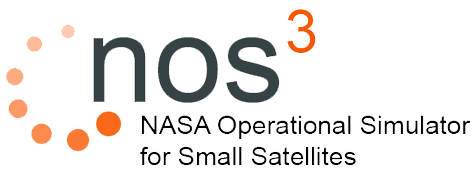

# Home

## Introduction

The Jon McBride Software Test and Research (JSTAR) laboratory at NASA's Katherine Johnson Independent Verification and Validation (IV&V) facility is proud to provide an example of technologies it leverages daily to the space community.
The JSTAR team built West Virginia's first satellite, Simulation-To-Flight-1 (STF-1) to demonstrate the lifecycle value of a software-only operational simulator.
From STF-1, NOS3 was was born as an architecture for new missions to baseline and leverage as a starting point.
NOS3 is a virtual spacecraft environment enabling development, testing, and training for users.  
Its component-based structure facilitates integration of software modules, enabling developers to simulate spacecraft behavior, test instrument interfaces, and perform software/hardware integration. 

## Modules

NOS3 can be distilled down into various configurable modules that make up the environment:
* Flight Software
  * core Flight System (default)
  * F'
* Ground Software
  * Ammos Instrument Toolkit
  * Ball Aerospace
  * OpenC3 COSMOS
  * YAMCS (default)
* Simulations
  * Generic versions of standard COTS components
* Middleware
  * Hardware library (hwlib) that enables cross compilation for simulation and flight 
  * Time sync across all modules
* Dynamics
  * 42

## FAQ

1. How do I login to the NOS3 virtual machine?
    - user: jstar, password: jstar123!
    - user: vagrant, password: vagrant
2. NOS Engine bus ports fail on launch
    - NOS Engine allows dynamic connections and disconnects and ensures ports are closed before connecting. Ports may work again after an initial "Not connect".
3. When the cFS flight software starts it cannot find my application or startup script
    - Make sure that your application is built correctly and the shared object library (.so) is present. Likewise, ensure that the app name is correctly listed in `cfg/nos3_defs/cpuN_cfe_es_startup.scr` and `cfg/nos3_defs/targets.cmake`.
    - For further information, please check the NASA/cFS git repository and documentation.
4. How do I connect my own standalone flight software?
    - Be sure to have all port numbers consistent between all components in NOS3, including 42.
5. Why does cFS constantly crash on start-up and/or force me to restart my PC to rerun?
    - NASA's cFS is safety-critical flight software. Make sure you are building your applications to specification and that you are properly using the PSP and OSAL calls from within your apps.
    - It is best to **_not_** run cFS as sudo. If you are doing this, make sure you have configured for your host or are providing appropriate run-time arguments with cFS.
6. Can NOS3 be run across multiple computers?
    - Yes, the satellite and ground software can be split apart and run on their own VMs. The instructions can be found [here](https://github.com/nasa/nos3/wiki/NOS3-Build-and-Run-on-Multiple-VMs).
7. I am having trouble with windows line endings (\r) while building, what should I do?
    - Inside nos3/ directory run the following command in the terminal: `find . -type f -print0 | xargs -0 dos2unix`
    

### Why should NOS3 be used?

NOS3 should be used to validate the functionality and performance of satellite systems before deployment.
NOS3 can be used as a starting point for development and throughout the rest of the mission lifecycle.
It enables developers to test different scenarios and configurations, identify potential issues, and refine the system design.
By utilizing NOS3, the risks associated with satellite missions can be reduced and operational efficiency can be improved. Some of NOS3 features include:
1. Enabling multiple developers to build and test flight software with simulated hardware models
2. Serving as an interface simulator for science instrument / payload teams to communicate with prior to hardware integration
3. Supporting software development activities
4. Enabling hardware integration to parallel software development
5. Providing an automated testing framework
6. Increasing available test resources
7. Enabling operation of the simulated spacecraft using the ground software command and telemetry databases

### When should NOS3 be used?

NOS3 ideally is used for initial developer training to flight and ground software while components are still being selected. 
Once component selection occurs development can begin - this early start is important because software does not scale with the size of the mission.

### How should I go from NOS3 as is to my specific mission?

To tailor NOS3 for your specific mission, you would typically create new components within the framework that represent the unique hardware of your satellite system.
This involves defining the hardware interfaces, software behavior, and operational procedures specific to your mission.
By customizing and extending the existing components or creating new ones, you can tailor NOS3 to match your mission requirements.

### How to move from software / simulator to hardware once it arrives?

NOS3 isn't a substitute for hardware testing, just a tool to augment the number of types of tests possible.
The component development flow includes the development of a standalone checkout application that can more rapidly be developed, deployed, and tested on hardware.
The flight software will use the same functions and code developed and tested through that process allowing focus to shift to data flow and system level tests cleanly.

### What can NOS3 give me during Integration and Testing (I&T) ?

During I&T activities, NOS3 enables you to perform integration testing of your satellite system, validate the operational procedures, and verify the overall system performance.
NOS3 allows you to conduct end-to-end simulations, test different mission scenarios, and assess the behavior of the satellite system under various conditions.

### How to a move from software / simulator to hardware once it arrives?

NOS3 isn't a substitute for hardware testing, just a tool to augment the number of types of tests possible.
The component development flow includes the development of a standalone checkout application that can more rapidly be developed, deployed, and tested on hardware.
The flight software will use the same functions and code developed and tested through that process allowing focus to shift to data flow and system level tests cleanly.
