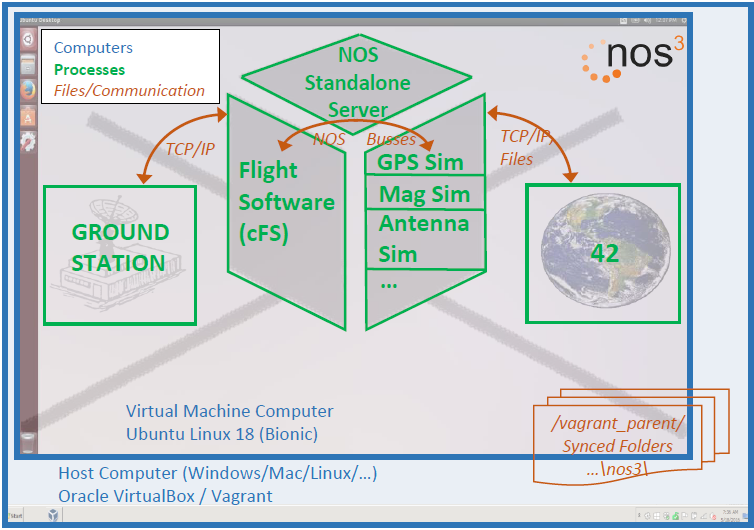
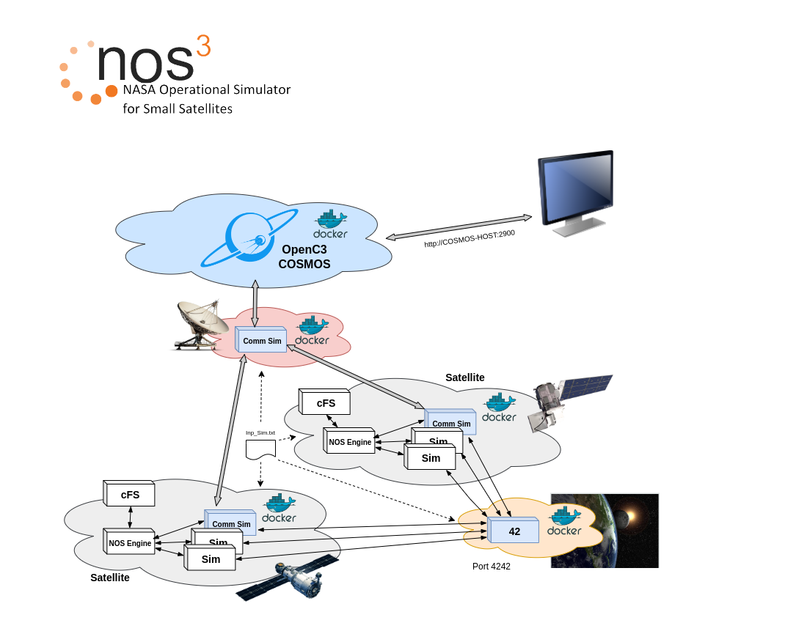

# Architecture
The figure below shows the architecture of NOS3.  To get started with NOS3, a NOS3 user needs to install Oracle VirtualBox and Vagrant on their host computer.  Both of these software packages are open source and can be run on various operating systems, including Microsoft Windows, Apple OS X, and Linux.  In addition to those software packages, NOS3 is comprised of a collection of files that are stored in a git repository. To get started with NOS3, the user receives a copy of those files and places them on their computer. These files include a Vagrantfile, which is a file that is used by the Vagrant software package to create an Ubuntu Linux Virtual Machine where all of NOS3 is run. During creation of the Ubuntu Linux Virtual Machine, various software packages may be installed via Ansible, including AIT, COSMOS, 42, and the NOS Engine libraries and NOS Standalone Server. An alternative to starting with Vagrant is to receive an already generated VirtualBox Virtual Machine with the various packages installed. To build and run the core flight software, simulators, and so on, the source code will need to be present as described below. 

---
## **Original Basic Architecture**

Source code for various simulators is accessible on the virtual machine through shared folders which allow access to the same files on the host computer and the virtual machine computer. Build tools can be used on the virtual machine to build and install simulators such as a GPS simulator, a generic reaction wheel simulator, a camera simulator, and more. In addition, two special software tools are built and installed as part of the simulators. The first is a NOS time driver that provides time ticks to drive time for the various simulators, 42, and the flight software. The second is a simple terminal program which can be used by the operator to command and control other simulators using the NOS engine command bus on which all of the simulators can be nodes.

The cFS source code is also present on the virtual machine through the shared folders. Build tools can also be used to build and install the generic flight software. This flight software includes hardware libraries that can interface as nodes on NOS Engine busses in place of the real hardware node and bus connections.

As shown in the figure, TCP/IP or files can be used to provide environmental data from 42 to the various simulators. In addition, TCP/IP can be used to interface COSMOS with laboratory versions of command and telemetry applications in cFS. Finally, the NOS Engine libraries are used to provide the software busses and nodes for communication between the flight software and the simulated hardware and for distribution of simulation time.

As of the newest releases, everything in NOS3 has been Dockerized, with CFS, 42, and each component of a spacecraft all running within its own container, with the containers of a single spacecraft networked together. A COSMOS instance is then linked to this spacecraft net, and all spacecraft nets are linked to the NOS3 Time Driver's network, which assures consistent time pulses across all devices. These docker containers are launched largely through a series of bash scripts, due to difficulties and redundancies of integrating compose into our existing environment.

---
## **Basic Docker Architecture**

---
## **Current Docker Architecture**

The newest versions also include a prototype multiple spacecraft capability, which can run multiple spacecraft all time-synched with each other, though the ability to properly command and coordinate them, along with some performance improvements, are still under development.