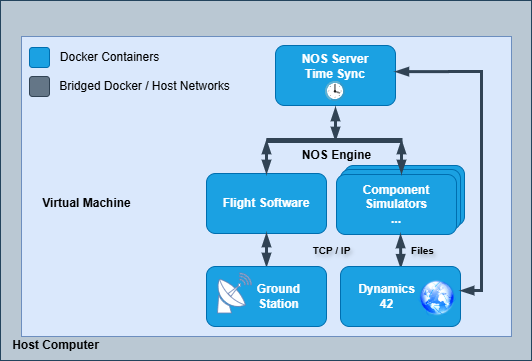
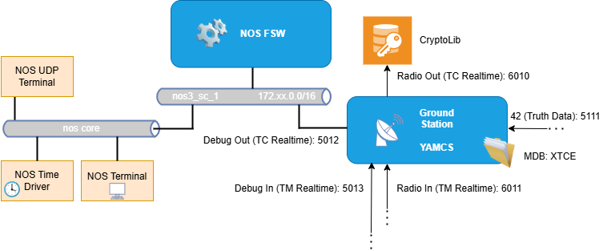
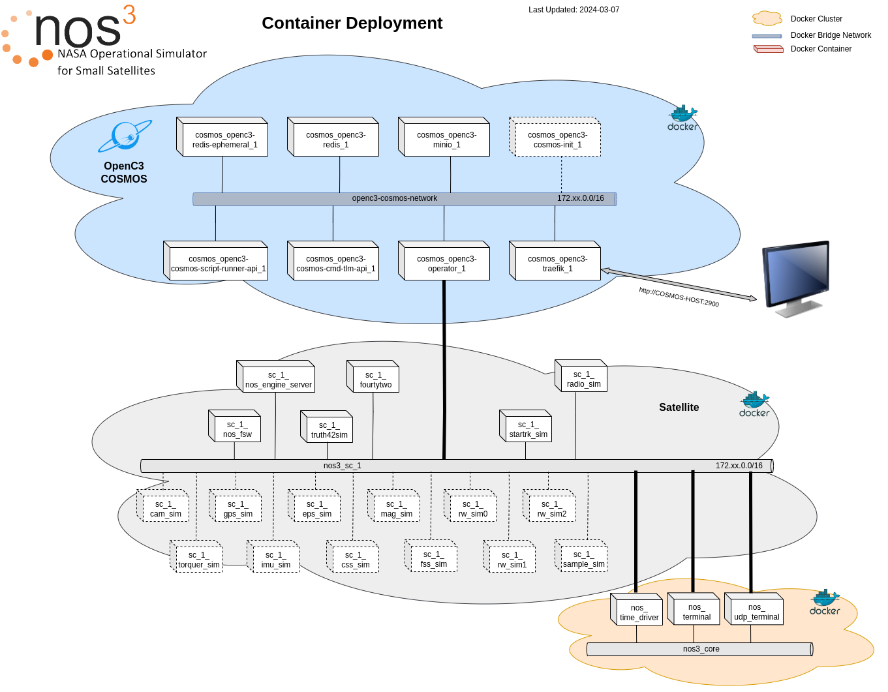

# Architecture
NOS3 runs typically runs using Docker on a Linux Virtual Machine (VM), although any computer running Linux and capable of using Docker will work.  The figure below shows the current architecture and Docker networking and structure.

## Basic Architecture

Above is a very basic architecture description of NOS. The image depicts several docker containers running within a virtualized system on a host machine.  Within the virtualized environment exists a ground station, connections to flight software, and many componenets and simulators, as well as a dynamics engine, all kept in-sync through NOS Engine busses, and time control within NOS Server. 

---
## GSW (YAMCS) Connectivity to FSW

The image above shows basic connectivity between Ground Station and Flight software.  Full connectivity is not shown, but basic docker network connections, and specific ports are shown in order to aid users in knowing what communication happens on which ports and which networks, and how to connect different applications as neccary.

---
## **Current Docker Architecture**

Every process in NOS3 runs in its own container (as is best practice) and Docker networks are used to separate different groups of containers from one another.  On the top of the graphic is a cloud labeled 'COSMOS', but in current versions that can be either OpenC3, COSMOS, or YAMCS, the latter being the default.  This is the ground software with which the satellite(s) can be commanded.  Each satellite consists of a group of containers placed in its own network, illustrated in the grey cloud and labeled 'nos3_sc_1'.  Then there exists a group of universally necessary containers which can be shared between the different satellites, which are assigned to 'nos3_core'.

The satellite containers can be replicated and kept each within their own network, although at present there is only capability to command one of them.  The containers kept within 'nos3_core', however, will be added to the various satellite networks but never duplicated, as that would either cause unnecessary trouble (in the case of nos_terminal and nos_udp_terminal) or defeat the purpose entirely (as would be the case with the time driver). 

---
## **Satellite Architecture**

Within each satellite, there are a variety of different simulators to represent different parts of the vehicle.  Most of these containers are kept entirely within the spacecraft network, and are therefore unable to communicate to ground software; the radio, however, is on both the satellite network and the ground software network so as to allow it to communicate between the spacecraft and the simulated ground station.  Other than the component simulators, there is an environment simulator (fortytwo), a container running the flight software (typically cFS, although efforts to add F' as an option are underway), and a NOS Engine Server container are also present on each spacecraft network. 

Source code for the various simulators is accessible from Github, either cloned directly in to the Linux VM or cloned into the host machine and shared in via shared folders.  Build tools can be used on the virtual machine to build and install simulators such as a GPS simulator, a generic reaction wheel simulator, a camera simulator, and more.  In addition, two special software tools are built and installed as part of the simulators.  The first is a NOS time driver that provides time ticks to drive time for the various simulators, 42, and the flight software.  The second is a simple terminal program which can be used by the operator to command and control other simulators using the NOS engine command bus on which all of the simulators can be nodes.

The cFS source code is also present on the virtual machine through the shared folders.  Build tools can also be used to build and install the generic flight software.  This flight software includes hardware libraries that can interface as nodes on NOS Engine busses in place of the real hardware node and bus connections.

As shown in the figure, TCP/IP or files can be used to provide environmental data from 42 to the various simulators. In addition, TCP/IP can be used to interface COSMOS with laboratory versions of command and telemetry applications in cFS. Finally, the NOS Engine libraries are used to provide the software busses and nodes for communication between the flight software and the simulated hardware and for distribution of simulation time.

### **Multiple Satellite Architecture**

NOS3 is designed to allow for the simulation of multiple spacecraft simultaneously.  At present, however, it is not possible to connect to or command any satellites but the first.
