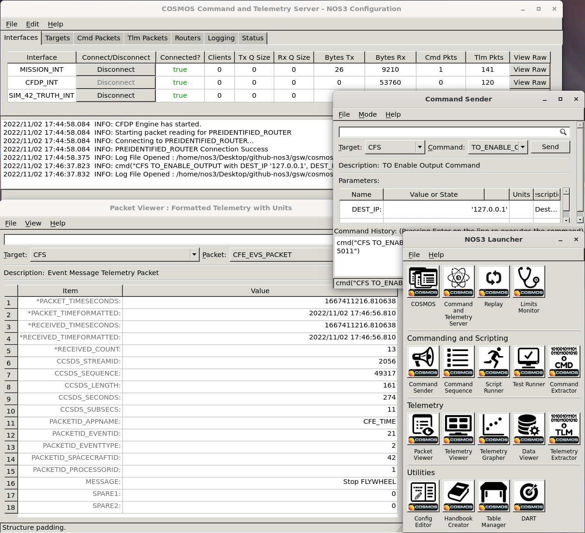
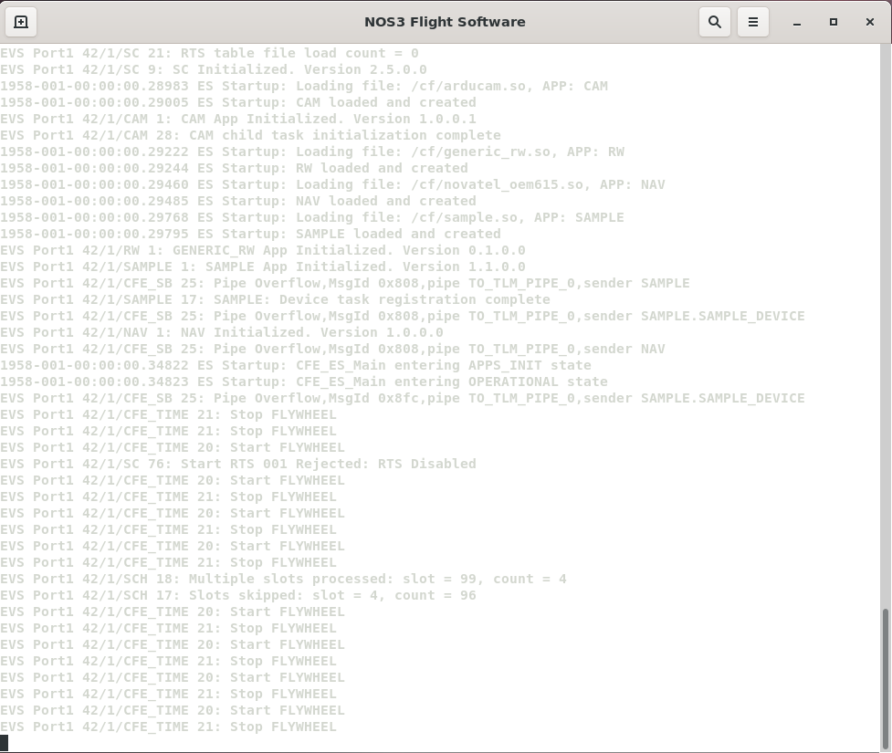
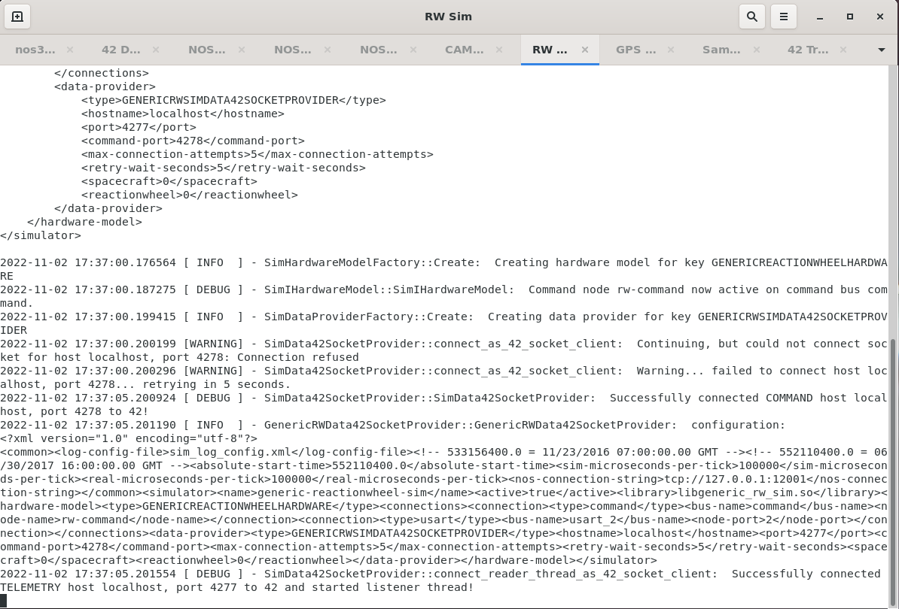
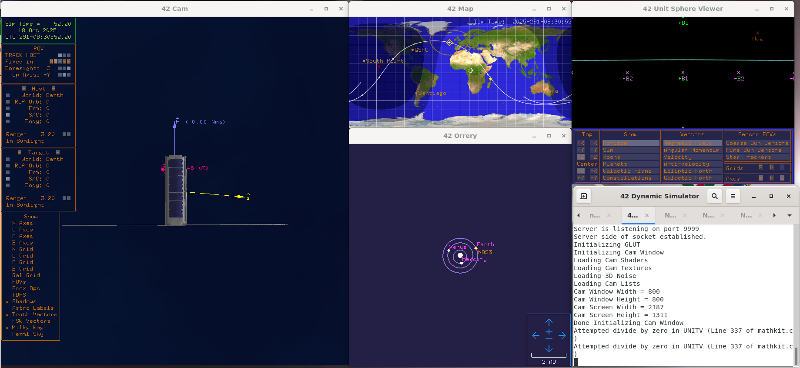
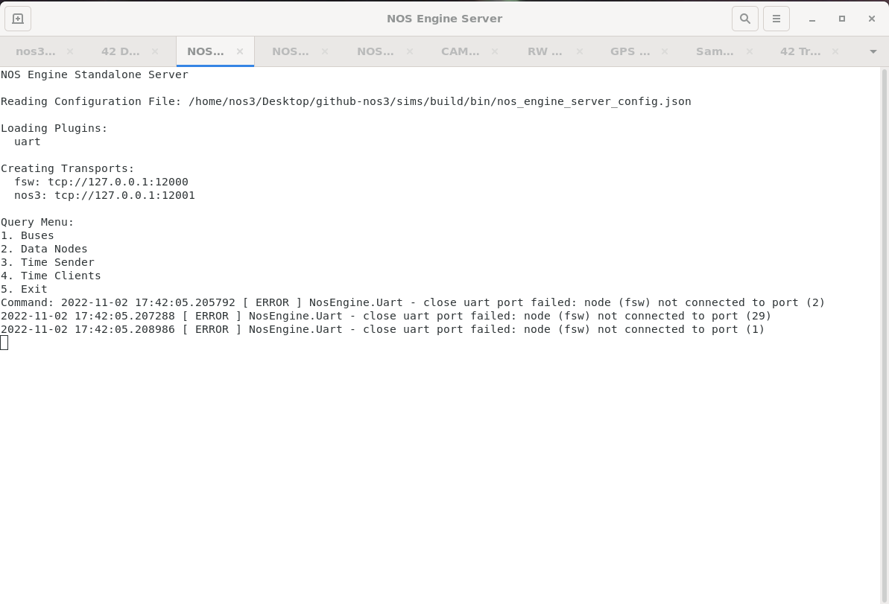

# Executables and Windows

When executed via `make launch`, NOS3 starts a myriad of executables with windows that are displayed.  The number of windows can be overwhelming.  This page is an attempt to describe the order to this chaos of windows.  The executables/windows can be separated into the following categories:  COSMOS, Flight Software, Simulators, 42, and NOS Engine Standalone Server.  Each of these is described in a section below.

## Window usage
There are different use cases for using different groups of windows depending on the need.  
1.  From a spacecraft operator perspective, they can only communicate with the spacecraft via commands and telemetry so the COSMOS windows would be their primary interest.
2.  From a spacecraft component developer perspective, they are interested in the functionality of the component application and the associated hardware simulation, so the flight software window and the specific simulator window would be of interest.  The COSMOS command and telemetry windows may also be of interest.  Also, the dynamics data from 42 that might be sent to or from the hardware simulator may also be of interest.
3.  From a NOS Engine hardware communication bus perspective, the NOS Engine Standalone Server window can show the busses and nodes in the system.

## COSMOS
COSMOS is stated to be “The User Interface for Command and Control of Embedded Systems”. It is used by NOS3 as the ground station command and control system to send commands to and receive telemetry from the NOS3 flight software. COSMOS is installed as a Ruby Gem. The configuration for NOS3 has been created by configuration files which define the NOS3 “system” and are located in gsw/cosmos/config/system (which refers to the many other configuration files in gsw/cosmos/config).  Only a single _Legal Agreement_ splash screen window is started by NOS3, but confirming that window displays the _NOS3 Launcher_ window from which many other windows can be started, including the _COSMOS Command and Telemetry Server_ window, one or more _Command Sender_ windows, one or more _Packet Viewer_ windows, and many others.  The image below shows the _NOS3 Launcher_ and several other COSMOS windows:

###Flight Software
A single terminal window is started for the NOS3 flight software.  This is the flight software that will execute on a spacecraft single board computer, but cross compiled to run on Linux and to use a hardware library that connects the flight software to the software only NOS Engine busses with their simulated hardware components instead of the actual flight hardware sensors and actuators.  The image below shows the flight software terminal:

## Simulators
Each simulator (including the NOS Time Driver and the Simulator Terminal) starts up in its own window (although they may be tabs in the same terminal).  The simulators are all built and installed from source code. The installation location is sims/build/bin. Various data and configuration files for the simulators can also be found in that location. Two of the main configuration files are as follows. The sim_log_config.xml file specifies the level and location of logging for the simulators. The nos3-simulator.xml file specifies the configuration for the simulators including common time, logging, and configuration information and information specific to each simulator. The specific information defines things like the name of the simulator and if it is active, the hardware model (used to find the code plugin) for the simulator, the connection information (bus and name or address) for the simulator, and any environmental data provider information. The exact information for each simulator depends on the simulator, the hardware model, and potentially the data provider.  Data shown in the simulator window is the log data for that simulator.  The image below shows an example simulator window for the reaction wheel simulator:

## 42
42 is a dynamics simulator.  It starts up one terminal window and then several GUI windows including a camera window, a map window, an orrery (solar system model) window, and a unit sphere viewer window.  The image below shows these windows:

42 is a general-purpose, multi-body, multi-spacecraft simulation. For NOS3, it simulates the motion of the simulated spacecraft. The progression of time for 42 is driven through NOS Engine and 42 provides output ephemeris, attitude, sun vector, magnetic field vector, and other environmental data to simulators that are part of NOS3. 42 is open source C code. For NOS3 it is installed on the virtual machine in the directory /opt/nos3/42. The STF-1 specific configuration files can be found in the directory sims/cfg/InOut. The main configuration files are the following:
1. Inp_Sim.txt – The main configuration file which defines items such as the environment (epoch, gravity models, celestial bodies, etc.), spacecraft reference orbits and configuration files, spacecraft and configuration files, and ground station locations.
2. Orb_ISS.txt – Spacecraft reference orbit file referred to by Inp_Sim.txt. This file specifies the orbit center (Earth) and the Keplerian orbital elements for the reference orbit.
3. SC_NOS3.txt – Spacecraft definition file referred to by Inp_Sim.txt. This file defines labels, orbit parameters, initial attitude, body parameters, sensor parameters, actuator parameters, and other parameters specific to the spacecraft.
4. Inp_IPC.txt – File defining the TCP/IP or file parameters for communicating input and output to and from 42.  This data is used by the hardware simulators.
5. Inp_Graphics.txt – File defining the GUI configuration for 42, including what windows to display, parameters for the point of view, various display elements such as grids, vectors, and labels, and other graphic elements properties.
6. There are several other input files which are not used in NOS3, including Inp_Cmd.txt (defining a command script for 42), Inp_FOV.txt (defining fields of view), Inp_Region.txt (defining regions for 42), and Inp_TDRS.txt (defining TDRS satellites for 42).

## NOS Engine Standalone Server
A single terminal window is started for the NOS Engine Standalone Server.  It has basic functionality to list busses, data nodes, time clients, time sender and to terminate.  The NOS Engine Standalone Server provides the software simulated communication bus structure that is used by NOS3 to connect the flight software with simulated flight hardware. NOS Engine Standalone Server is installed when the ITC NOS Engine package is installed. The executable is nos_engine_server_standalone. For NOS3, the server is configured using the file sims/build/bin/nos_engine_server_config.json which defines plugin protocols and uniform resource identifiers (URIs) for the server.  The single terminal window looks like the following:

