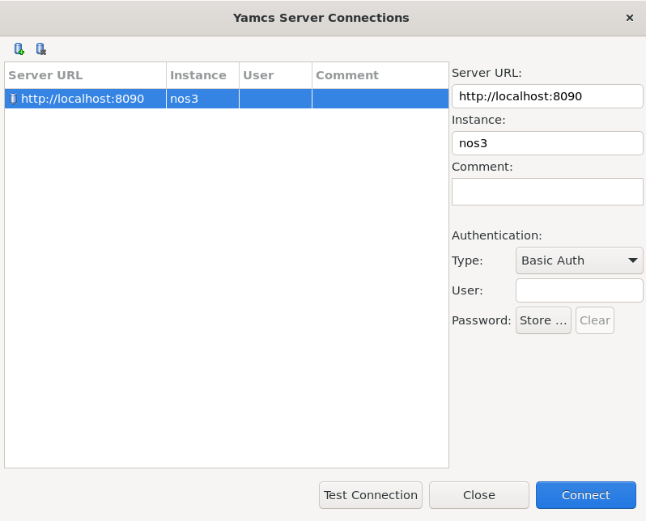
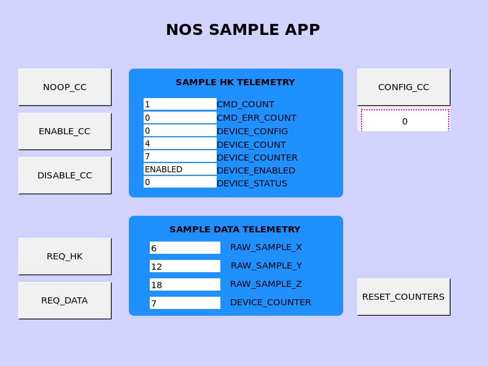
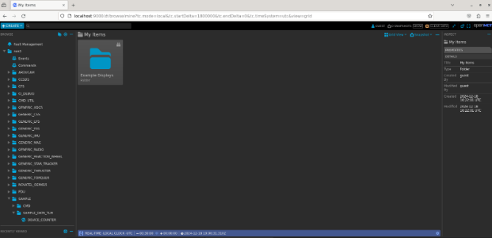
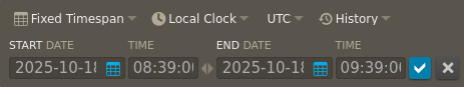
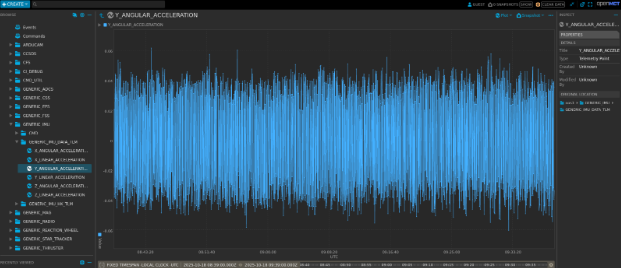

# Ground Systems
NOS3 supports YAMCS, COSMOS 4, COSMOS 5, Fprime, and AIT ground software out of the box. There is a parameter in the master configuration file to switch between them. COSMOS 4 is lighter weight and easy to use, while COSMOS 5 is more performance heavy and slightly more difficult to use, but is actively developed.

## YAMCS - Yet Another Mission Control System

Yamcs /jæmz/ is open source mission control software developed by Space Applications Services, an independent Belgian company, with a subsidiary in Houston, USA.
Yamcs is developed around the criteria of flexibility and open source code to innovate, reduce MCS development, implementation and integration costs through easy expandability, scalability, and adaptability over time.

**Space Standards**
- CCSDS/OMG XML Telemetric and Command Exchange (XTCE) v1.1 and v1.2
- CCSDS 133.0-B-2 Space Packet Protocol
- CCSDS Space Data Link Protocols (AOS/TM/USLP/TC frames)
- CCSDS 232.1-B-2 Communications Operation Procedure (COP-1)
- CCSDS File Delivery Protocol (CFDP)
- CCSDS Space Link Extension (FCLTU/RAF/RCF)

### YAMCS Studio Integration

Obtain the tarball appropriate to your system. Note that YAMCS Studio requires JRE for Java 11 or higher.
https://github.com/yamcs/yamcs-studio/releases

Extract the tarball to your system, and you can run then ./'Yamcs Studio'
The YAMCS studio User's Guide is a great resource for setting up these interfaces, and this is how the JSTAR team accomplished this.
We've also created a custom OPI file for the SAMPLE application that will allow users to view how scripting works to connect buttons to commands and telemetry.

Users can create a new project within the Display Builder within YAMCS Studio, and then import JSTAR's NOS_SAMPLE_APP.opi
Select the OPI file, and click the green play button to advance to the Display Runner (This will bring up the NOS Sample App OPI window)
From the Options ribbon at the top, select YAMCS, and then Connect. (This assumes you already have NOS3 and the YAMCS Web gui running, functional, and receiving telemetry).



Following successful connection, users should be able to run the Enable_CC command from the sample app OPI, and begin seeing telemetry:



OPI Files are currently stored within `gsw/yamcs-studio` under the nos3 root directory.

### YAMCS and OpenMCT

Open MCT requires more user interaction to prepare and use.  Below are a brief set of instructions for getting started:

Begin by installing Node Version Manager – This makes installing the appropriate version of NPM easier. 

> `curl -o- https://raw.githubusercontent.com/nvm-sh/nvm/v0.40.1/install.sh | bash `

The ~/.bashrc file must now be sourced in order to access NPM commands: 

> `source ~/.bashrc `

Install Version 21 of the Node Package Manager: 

> `nvm install 21 `

Download the akhnery opnmct-yamcs repository: 

> `git clone https://github.com/akhenry/openmct-yamcs.git `

Access the repository and modify the example index.js file. 

> `example/index.js `

The YAMCS config needs to be modified to fit our YAMCS instance: 

```
yamcsDictionaryEndpoint: "http://localhost:8090/", 
yamcsHistoricalEndpoint: "http://localhost:8090/", 
yamcsWebsocketEndpoint: "ws://localhost:8090/api/websocket", 
yamcsUserEndpoint: "http://localhost:8090/api/user/", 
yamcsInstance: "nos3", 
yamcsProcessor: "realtime", 
yamcsFolder: "nos3", 
```


If NOS3 has not been setup and started, navigate to the NOS3 directory and from a terminal run: 

```
make prep 
make  
make launch 
```

Return to the openmct-yamcs repository directory 

OpenMCT YAMCS plugin dependencies can now be installed and built.   

Access a terminal, and navigate to the base directory of the akhenry/openmct.git and run the following commands: 

```
npm install 
npm run build:example:master 
npm start 
```

YAMCS can also now be accessed from http://localhost:8090 

OpenMCT can now be accessed from http://localhost:9000 

---



A figure like the above should be seen.  From here the time window needs to be adjusted to match NOS3 time: 


Click the left most REAL-TIME LOCAL CLOCK UTC, and changed to a fixed timespan: 



The timeframe needs to be set to `2025-10-18, 08:39:00 `

The end Date can be any time after the initial start date. 

Click the blue checkmark 

---

Navigation to different applications and their telemetry data can be navigated to from the leSft menu. 

Below is an example of IMU data being displayed within the NOS3 Time window:



---

## COSMOS 4

COSMOS 4 is an open source ground system developed by Ball Aerospace ([COSMOS 4](https://ballaerospace.github.io/cosmos-website)) and is included with NOS3 to provide a lightweight ground system for the simulated spacecraft. COSMOS 4 is installed in its default directory and run from gsw/cosmos. The COSMOS 4 Launcher, and the windows launched by the _COSMOS_ button are pictured below.


### COSMOS 4 to cFS Command and Telemetry Link Up

The link to a Ground Station is completed by two applications in cFS. These are the command ingest (CI) and telemetry output (TO) applications. In NOS3 these apps utilize UDP to communicate and are not meant for flight operations. Communications is further split between the Debug and Radio channels, which connect to different UDP ports, the former directly, the second through the Radio Component. The Debug CI and TO links are active by default, however Radio TO link is closed by default on start-up, but can be activated by sending a specific command packet. Commanding is done by using the Command Sender tool in COSMOS 4, which should open up after pressing the _'COSMOS'_ Key on the launcher, as it is one of the core windows. The Radio TO link is enabled using the target named ‘CFS_RADIO’ with a single command to ‘TO_ENABLE_OUTPUT’. Once sent, the TO app will reply stating that telemetry is enabled, as shown in the screenshot below. It should be noted that only telemetry listed in the ‘cfg/nos3_defs/tables/to_config.c’ will be captured. Additional telemetry can be appended as necessary.


Telemetry from the Radio TO link can be confirmed by observing that the 'Tx Bytes' and 'Rx Bytes' values are incrementing for the 'RADIO' line in the COSMOS CmdTlmServer window. Additional ways to confirm successful processing of the command can be accomplished by examining the output on the 'NOS3 Flight Software' terminal window or the output on the 'Radio Sim' terminal window. Both windows will have frequent output when the Radio TO link is enabled.


## COSMOS 5

COSMOS 5 is an open source ground system provided via OpenC3 (originally developed by Ball Aerospace) ([COSMOS 5](https://docs.openc3.com/docs)) and is included with NOS3 to provide a modern, web-based ground station for the simulated spacecraft. COSMOS 5 is installed in its default directory and run from gsw/cosmos. The COSMOS 5 interface is pictured below.


### COSMOS 5 to cFS Command and Telemetry Link Up

The link to a Ground Station is completed by two applications in cFS. These are the command ingest (CI) and telemetry output (TO) applications. In NOS3 these apps utilize UDP to communicate and are not meant for flight operations. Communications is further split between the Debug and Radio channels, which connect to different UDP ports, the former directly, the second through the Radio Component. The Debug CI and TO links are active by default, however Radio TO link is closed by default on start-up, but can be activated by sending a specific command packet. Commanding is done by using the Command Sender tool in COSMOS 5, accessible from the main screen. The Radio TO link can be started using the target named ‘CFS_RADIO’ with a single command to ‘TO_ENABLE_OUTPUT’. Once sent, the TO app will reply stating that telemetry is enabled. This is demonstrated in the screenshot below. It should be noted that only telemetry listed in the ‘cfg/nos3_defs/tables/to_config.c’ will be captured. Additional telemetry can be appended as necessary.


### AIT

While AIT appears to be functionaly.  It is not currently in a maintained state.  It is provied as a proof of concept.  The pieces that are actively maintained are those in the default configuration.

### F Prime GDS

FPrime flight software is provided by JPL.  it is not currently in a maintained state within the NOS3 project.  It is proved currently as a proof of concept.  The pieces that are actively maintained are those in the default configuration.  However, FPrime will be maintained and integrated into the default configurations of NOS3 in the very near future.

## Selecting Ground System

The Ground System may be selected using the `gsw` parameter in the `nos3-mission.xml` file in the `cfg` directory. Setting the value to `cosmos` will select COSMOS4, and setting it to `openc3` will select COSMOS 5.  Setting this value to yamcs will utilize the YAMCS Ground software, and likewise, setting to fprime, will utilize the built in Fprime GDS (currently only compatable with FPrime FSW) 

The screenshot below shows the default, COSMOS 4 configuration. Note that in order to switch, if you've run NOS3 previously on your VM, you need to run `make stop-gsw` to make sure your previous ground system is stopped. This must be run before you run `make clean`, or else you'll need to remake, run `make stop-gsw`, then run `make clean`, `make prep`, `make`, and `make launch`, and you should have you desired ground system running. You can use the command `docker ps` to verify the correct GSW suite is running.


## Packet Formatting

All communications to, from, and internal to cFS, regardless of which Ground System you are using, are formatted using the CCSDS standard packet type with the secondary header enabled. This secondary header allows the specific command to be passed to the application specified in the primary header. COSMOS requires knowledge of these commands and telemetry structures to be able to construct and interpret them as needed. An example is provided below:


