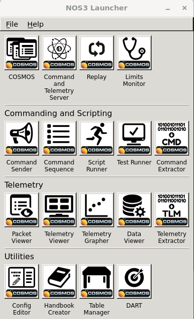
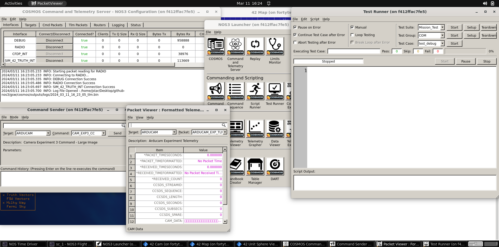
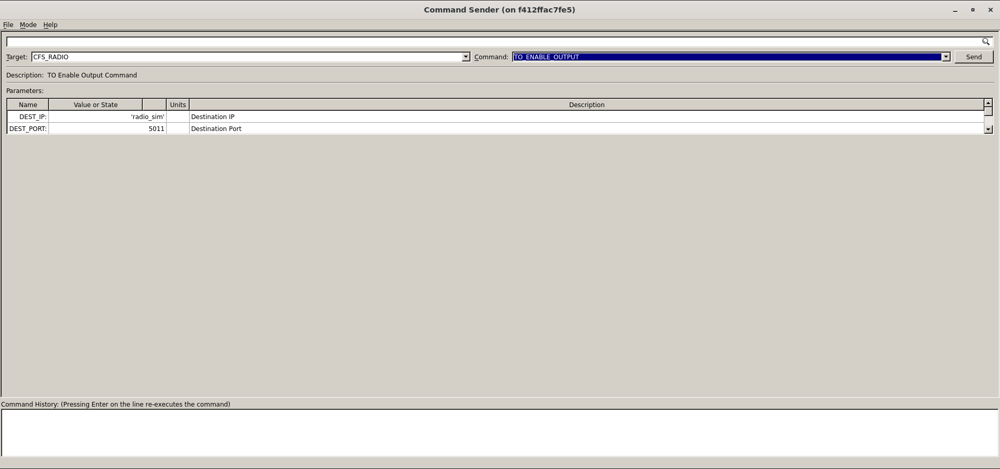
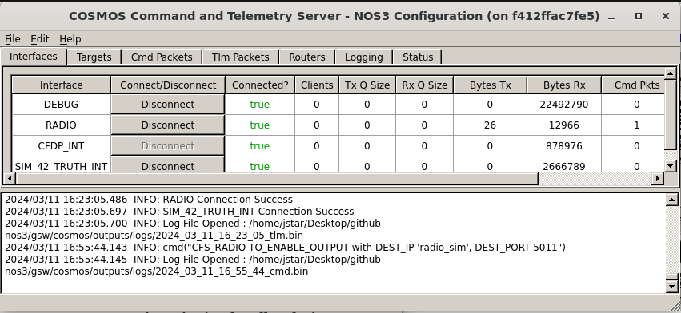
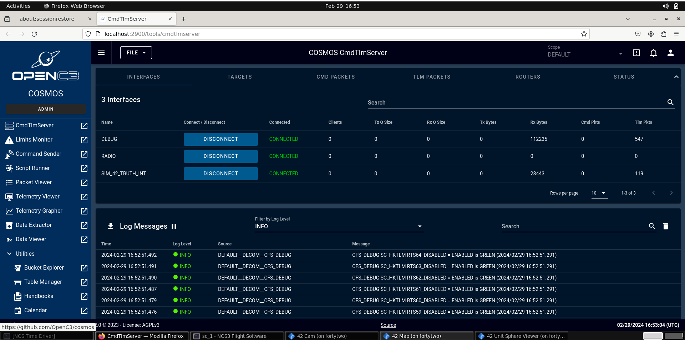
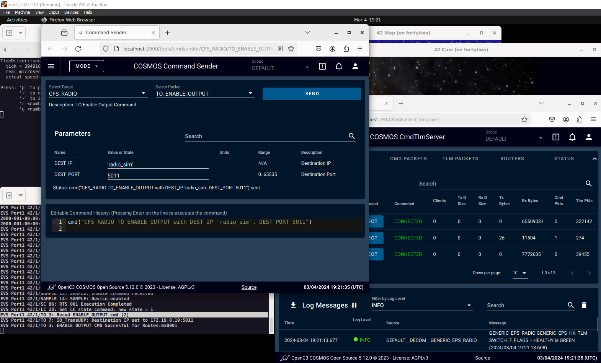
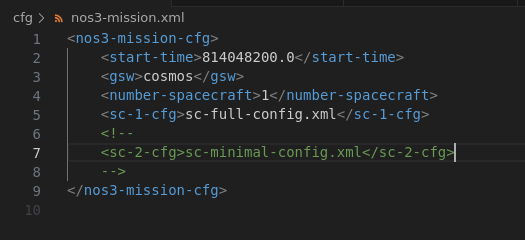
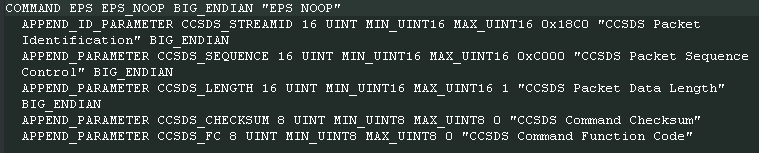

# Ground Systems
NOS3 supports both Ball Aerospace's COSMOS 4 and OpenC3's COSMOS 5 Ground Software out of the box, with a parameter in the Master Config file to switch between them. COSMOS 4 is lighter weight and easy to use, while COSMOS 5 is more performance heavy and slightly more difficult to use, but is actively developed.

## YAMCS - Yet Another Mission Control System

Add a blurb here and some images about YAMCS.  Discuss use (maybe another page) - and some screenshots.

## COSMOS 4

COSMOS 4 is an open source ground system developed by Ball Aerospace ([COSMOS 4](https://ballaerospace.github.io/cosmos-website)) and is included with NOS3 to provide a lightweight ground system for the simulated spacecraft. COSMOS 4 is installed in its default directory and run from gsw/cosmos. The COSMOS 4 Launcher, and the windows launched by the _COSMOS_ button are pictured below.

### COSMOS 4 to cFS Command and Telemetry Link Up

The link to a Ground Station is completed by two applications in cFS. These are the command ingest (CI) and telemetry output (TO) applications. In NOS3 these apps utilize UDP to communicate and are not meant for flight operations. Communications is further split between the Debug and Radio channels, which connect to different UDP ports, the former directly, the second through the Radio Component. The Debug CI and TO links are active by default, however Radio TO link is closed by default on start-up, but can be activated by sending a specific command packet. Commanding is done by using the Command Sender tool in COSMOS 4, which should open up after pressing the _'COSMOS'_ Key on the launcher, as it is one of the core windows. The Radio TO link is enabled using the target named ‘CFS_RADIO’ with a single command to ‘TO_ENABLE_OUTPUT’. Once sent, the TO app will reply stating that telemetry is enabled, as shown in the screenshot below. It should be noted that only telemetry listed in the ‘to_config.h’ will be captured. Additional telemetry can be appended as necessary.

Telemetry from the Radio TO link can be confirmed by observing that the 'Tx Bytes' and 'Rx Bytes' values are incrementing for the 'RADIO' line in the COSMOS CmdTlmServer window. Additional ways to confirm successful processing of the command can be accomplished by examining the output on the 'NOS3 Flight Software' terminal window or the output on the 'Radio Sim' terminal window. Both windows will have frequent output when the Radio TO link is enabled.

## COSMOS 5

COSMOS 5 is an open source ground system provided via OpenC3 (originally developed by Ball Aerospace) ([COSMOS 5](https://docs.openc3.com/docs)) and is included with NOS3 to provide a modern, web-based ground station for the simulated spacecraft. COSMOS 5 is installed in its default directory and run from gsw/cosmos. The COSMOS 5 interface is pictured below.

### COSMOS 5 to cFS Command and Telemetry Link Up

The link to a Ground Station is completed by two applications in cFS. These are the command ingest (CI) and telemetry output (TO) applications. In NOS3 these apps utilize UDP to communicate and are not meant for flight operations. Communications is further split between the Debug and Radio channels, which connect to different UDP ports, the former directly, the second through the Radio Component. The Debug CI and TO links are active by default, however Radio TO link is closed by default on start-up, but can be activated by sending a specific command packet. Commanding is done by using the Command Sender tool in COSMOS 5, accessible from the main screen. The Radio TO link can be started using the target named ‘CFS_RADIO’ with a single command to ‘TO_ENABLE_OUTPUT’. Once sent, the TO app will reply stating that telemetry is enabled. This is demonstrated in the screenshot below. It should be noted that only telemetry listed in the ‘to_config.h’ will be captured. Additional telemetry can be appended as necessary.

## Selecting Ground System

The Ground System may be selected using the `gsw` parameter in the `nos3-mission.xml` file in the `cfg` directory. Setting the value to `cosmos` will select COSMOS4, and setting it to `openc3` will select COSMOS 5. 

The screenshot below shows the default, COSMOS 4 configuration. Note that in order to switch, if you've run NOS3 previously on your VM, you need to run `make stop-gsw` to make sure your previous ground system is stopped. This must be run before you run `make clean`, or else you'll need to remake, run `make stop-gsw`, then run `make clean`, `make prep`, `make`, and `make launch`, and you should have you desired ground system running. You can use the command `docker ps` to verify the correct GSW suite is running.

## Packet Formatting

All communications to, from, and internal to cFS, regardless of which Ground System you are using, are formatted using the CCSDS standard packet type with the secondary header enabled. This secondary header allows the specific command to be passed to the application specified in the primary header. COSMOS requires knowledge of these commands and telemetry structures to be able to construct and interpret them as needed. An example is provided below:

