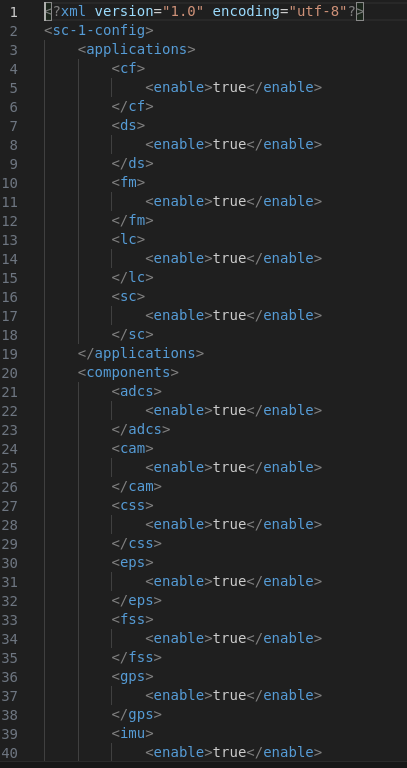
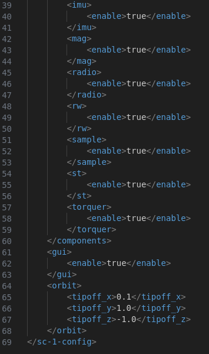
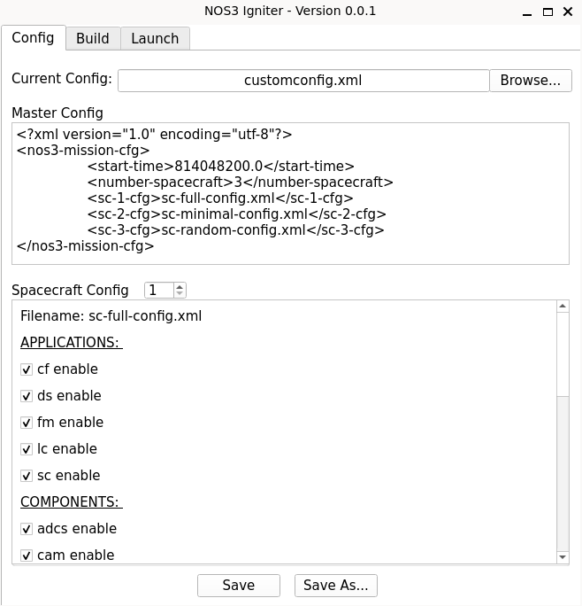
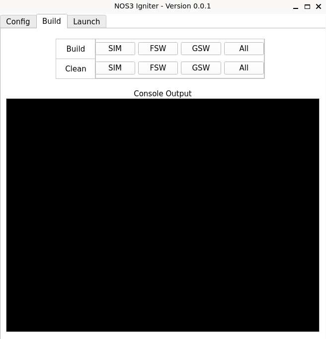
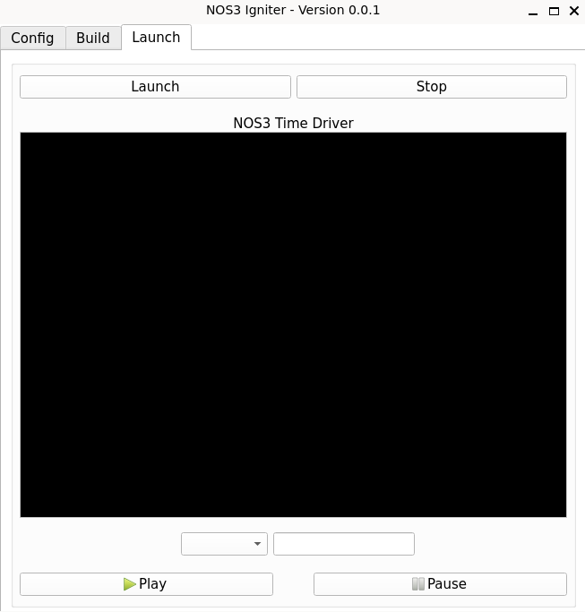

# Igniter

Igniter is installed and displayed via `make prep` and can be brought back up via `make igniter`.

Igniter is a tool for NOS3 that provides a simple Graphical User Interface to manage NOS3 Configurations, Components, Apps, and the like to allow the user to customize NOS3 to use only the components and apps they want or need. It also allows users to configure different spacecraft in a constellation differently if that is desired. One can load a configuration file, and then edit each spacecraft's configuration separately in the GUI if they desire. Igniter is split into 3 main views: the Configuration Tab, the Build Tab, and the Launch Tab.

## The Configution Tab

In order to load a configuration, the user simply needs to click browse next to the current configuation box and select their desired configuation. Configuration files are simple XML documents, and are separated into two main types: the Master Config and the Spacecraft Configs. There is only one Master Config for NOS3, but there may be multiple Spacecraft Configs.

- The Master Config, contains parameters for the number of satellites being simulated, the mission start time, and links to the configs for each individual spacecraft.
   

  
- The Spacecraft Configs contain parameters to enable or disable each Application and Component, to enable the 42 GUI to view the Dynamics Sim, and options to configure Orbital X, Y, and Z parameters.
  

The default master configuation file is found at the path *'cfg/nos3-mission.xml'* within the base NOS3 directory and the default Spacecraft config file, which has all options enabled, is found at the path *'cfg/sc-full-config.xml'* in the base NOS3 Directory.

Configurations may also be edited on the fly within the Igniter GUI before the mission is built and launched. There are buttons to Save or Save As so a user may use these edited configurations for future runs. The Spacecraft Config XML files will be saved under the same directory as the Master Config XML.

## The Build Tab

The Build Tab allows the user to clean or build the flight software, ground software, or the simulator parameters separately - or all of them together - at the push of a button. It will open a terminal window to execute the command, then returns a prompt instructing the user to press ENTER to close.

*NOTE: In Future Versions, the terminal output will be viewable in the console output section of this tab.*

## The Launch Tab

The Launch Tab allows the user to launch and stop the simulation with the buttons at the top of the pane without having to utilize the terminal.

*NOTE: In Future Versions, the Time Driver Output will display on this tab in the console output tab. The options below that pane will allow the user to specify a run time for the simulator in seconds, or to set a time for the simulator to automatically pause. This time is based on the system time for your machine, which is in UTC on the NOS3 VM. The Simulator will also be able to be paused or resumed manually with the buttons at the bottom of the pane.*

