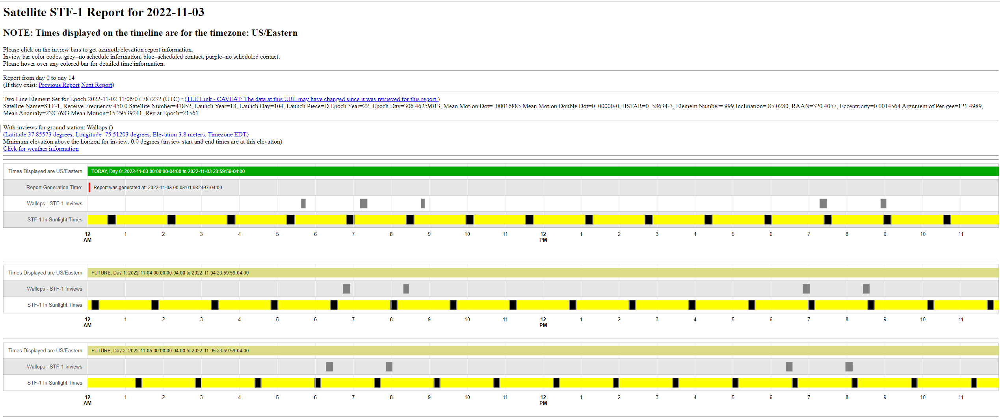

# OIPP
## Orbit, Inview, and Power Planning Tool

Several planning tools are envisioned to be created for STF-1 mission operations. The first is the Orbit, Inview, and Power Planning tool. The role of OIPP will be to execute daily and perform the following tasks:

1. Retrieve the most up to date two-line element set (TLE) data string for the STF-1 CubeSat,
2. Propagate this element set forward for a number of days in the future, compute in view periods with STF-1 ground antennas for a number of days in the future, and determine sunlight and eclipse periods for STF-1 for a number of days.

It should be noted that the accuracy of all predictions deteriorates as the propagation is performed further into the future, thus the most accurate data will typically be for the first day in the future predictions and the least accurate data will typically be for the last day in the future predictions. Thus, the later future data is used for approximate planning, while the near future data is used for upcoming day(s) operations.



OIPP can be executed on the NOS3 virtual machine using the command:
```
python3 ./gsw/OrbitInviewPowerPrediction/scripts/generate_html_report.py ./gsw/OrbitInviewPowerPrediction/config/stf1-simple.config
```
Note a few prerequisites:
1.  The directory `/var/www/html/test` must exist and be writable by the current user
2.  The following python pip modules must be installed:
    1.  pytz
    2.  pyorbital
    3.  geocoder
    4.  openpyxl
    5.  python-dateutil
    6.  matplotlib

At the completion of OIPP execution, an HTML OIPP report can be found beneath the directory `/var/www/html/test/stf1`