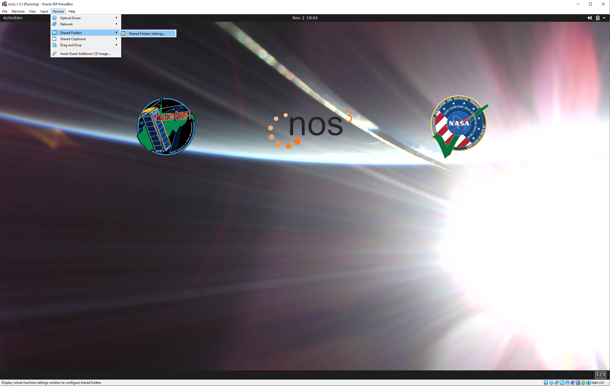
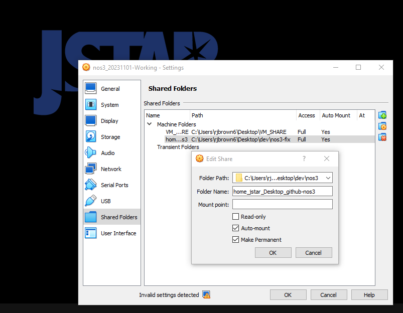

# Workflows & VM Settings

The recommended workflow for a NOS3 user/developer is to develop on the host machine, build and test in VM (git clone on the host, share the git folder into the VM).  This workflow makes use of the vagrant virtual machine to provide a stable environment for building and testing.  If using vagrant (`vagrant up`), the VM will have the source code folder shared into the VM as `/home/nos3/Desktop/github-nos3`.  If using Virtual Box to start the VM, the source code can be shared into the VM using the following directions:

1.  Go to Virtual Box menu -> Devices -> Shared Folders -> Shared Folders Settings...

2.  Add a new Shared Folder (folder with + sign) and select the location of the nos3 repository on the host
3.  Check `Auto-mount` and `Make Permanent`

4.  Reboot the VM

Once these steps are complete, all changes inside the VM will be reflected outside the VM and vice versa.
