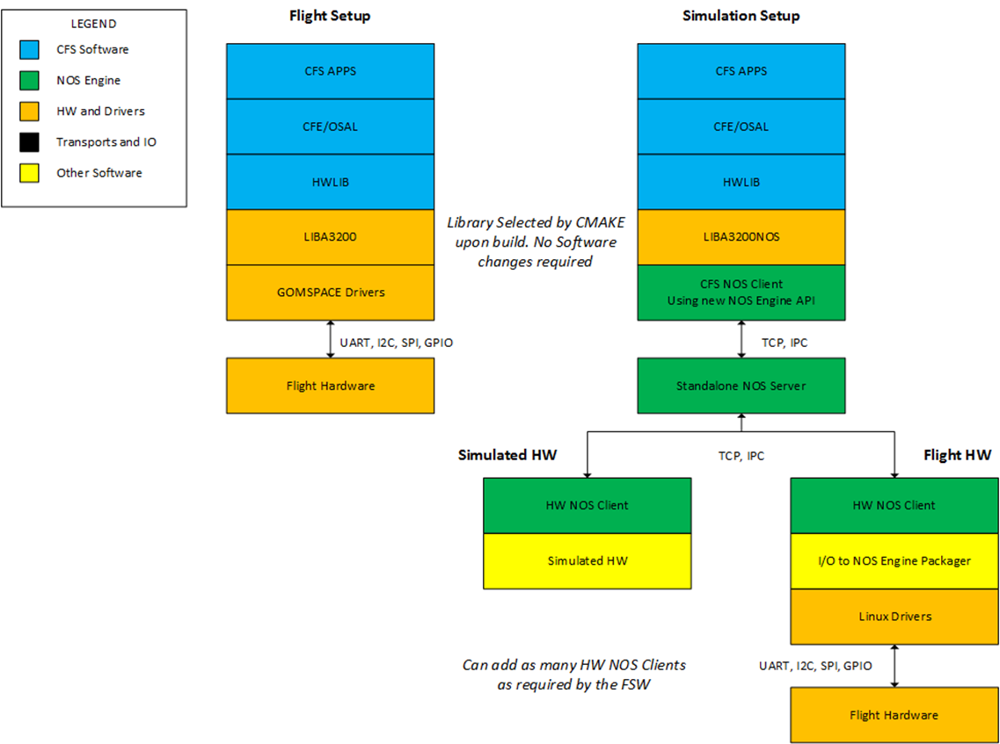

# cFS Flight Software Development

The preferred flight software (FSW) framework for use with NOS3 is the open-source Core Flight System (cFS) originally developed by NASA GSFC. This section will describe the method utilized to interface NOS3 with cFS, as well as a generic method to interface with any flight software that can compile for Linux.

## cFS and NOS3

### Operating System Abstraction Layer

Core Flight System is the FSW selected for the STF-1 mission partially due to the implementation of the Operating System Abstraction Layer (OSAL). The OSAL provides an API that allows flight software applications to be written without operating system (OS) specific calls. When cFS is compiled, the target OS is specified and the build system includes the proper libraries. This allows the FSW written for the FreeRTOS target to be built to execute on Linux and the opposite remains true. This makes NOS3 an ideal development environment when using the OSAL Linux target.

### Platform Support Package

In addition to the OSAL, cFS includes a Platform Support Package (PSP) that includes libraries that are not OS specific, but can be reused for a specific flight board, such as memory, clocks, timers, etc. The PSP used for NOS3 is a modified version of the Linux PSP release. In order to control timing in flight software, cFS uses multiple timers, the main being a 1 Hz timer tick. By replacing the 1 Hz timer provided by Linux with the NOS Engine time ticker we can sync the time from the PSP with the time that other NOS3 components are running.

### Hardware Library

The third component of flight software implemented for hardware abstraction is a hardware library (HWLIB). The HWLIB is used for component specific I/O calls, such as I2C, UART, etc. The hardware library includes a single header file, typically provided as drivers from the on-board computer (OBC) manufacturer, that defines the I/O function calls. When building cFS, the CMAKE build system then selects the driver source corresponding to the target being built.

As an example, the Clyde Space EPS I/O functionality is well defined in the user’s manual, and communications are performed over I2C. Using the NanoMind (STF-1 OBC) I2C drivers, a library called epslib.c is written to communicate over I2C and exercise all of the EPS functionality as described in its documentation. When compiling for the flight target, the NanoMind driver source code is selected by CMAKE and the executable can be run on the OBC. When compiling for Linux, the CMAKE build will select the NOS3 driver source code and the executable can be run in the NOS3 environment. With either path, the HWLIB and all code using the HWLIB will remain unchanged, and only the low level drivers will be effected. The diagram below shows the two path example as it applies to STF-1, where LIBA3200 is the NanoMind source, and LIBA3200NOS is the NOS3 source.



## Connecting cFS to NOS3

In order to use NOS3 with cFS, modifications are required to the open-source release. The recommended method for using NOS3 is described in the NOS3 User’s Guide, in which these modifications have already been made. If not using the cFS included with the NOS3 release, it is recommended to use the CMAKE build system, as the legacy build is not currently supported. The necessary changes are described below, where `proj` is the cFS directory being integrated.

1. Edit the `targets.cmake` file in the `fsw/nos3_defs` folder to include the list of applications to be built. Set the target name and system as shown below.
```cmake
SET(TGT1_NAME linux)
SET(TGT1_SYSTEM linux)
```
2. Edit the `toolchain-linux.cmake` file from the `fsw/nos3_defs` directory.
3. Edit the `nos-linux` PSP from the `fsw/psp/fsw` directory.
4. Add to the `components` directory as needed.
5. Create `fsw/apps/hwlib` or edit the `fsw/apps/hwlib` directory.
   1. The `CMakeLists.txt` file in `fsw/apps/hwlib` provides a good example of how to include driver source code as described below.
   2. Add a `sim` folder to this directory to store the NOS3 drivers for I/O. (See below for an example driver)

## NOS3 Drivers and Other FSW

It is possible to connect NOS3 to FSWs other than cFS, although this has not been extensively tested. The two main requirements are the availability of source code for the I/O drivers, and the ability to compile/run on Linux. If these two conditions are met, the drivers for the target hardware can be swapped for NOS3 drivers as described in previous sections.

### Writing a NOS3 Driver

The NOS3 source is the best resource for examples to aid in writing a new NOS3 driver. The UART driver and STF-1 NAV (navigation) application will be used in the example described in this section. For this example, the NAV application is written for cFS and located in the `novatel_oem615` component folder, but this application could just as easily be any other FSW source file.

#### Application and Hardware Library

The application that is communicating with hardware will require the I/O calls to be implemented exactly as provided by the OBC manufacturer. The NAV application makes certain calls to a Novatel GPS over the UART from the OBC. Not all of the GPS functionality is necessary to be exercised by the NAV application, so the low level calls to the UART are wrapped in functions in the hardware library, and the NAV app includes this library. As an example, the NAV application will be commanded to get the current Position/Velocity/Time reading, and will make the call `NAV_ReadAvailableData` as seen in the following code excerpt. Notice the include statement for the hardware library.

```c
#include “hwlib.h”
/* some code removed for readability see components/novatel_oem615/fsw/src/nav_app.c */
/* Request NAV data */
case NAV_REQ_DATA_CC:
    CFE_EVS_SendEvent(NAV_CMD_REQ_DATA_EID, CFE_EVS_DEBUG,"Request NAV GPS Data");
    /* todo - fix the 1024 hard coded number */
    DataBuffer = (uint8_t *)malloc((1024) * sizeof(uint8_t));
    /* Read the GPS data from the UART */
    NAV_ReadAvailableData(DataBuffer, &DataLen);
    GPSSerialiation GPSData = NAV_ParseOEM615Bestxyza(DataBuffer, DataLen);
```

The function `NAV_ReadAvailableData` is a wrapper for the low level UART calls to the OBC driver. The function can be seen in the following code excerpt. This code must include the hardware library, as seen in the first line of the excerpt, which includes the OBC drivers itself. The function calls beginning with `uart_` are from the OBC driver.

```c
#include ”hwlib.h”
/* some code removed for readability see components/novatel_oem615/fsw/src/nav_app.c */
static void NAV_ReadAvailableData(uint8 DataBuffer[], int32 *DataLen)
{
    int32 i = 0;
    /* check how many bytes are waiting on the uart */
    *DataLen = uart_bytes_available(NAV_UART.handle);
    //OS_printf("NAV_ReadAvailableData(): gps messages waiting: %ld bytes\n", (long int)*DataLen);
    /* declare an out buffer to hold that data */
    if (*DataLen > 0)
    {
        /* grab the bytes */
        uart_read_port(NAV_UART.handle, DataBuffer, *DataLen);
    }
    else
    {
        /* OS_printf("GPS_ReadAvailableData(): gps uart data len is 0\n"); */
    }
```

### The NOS3 Driver

The example described above uses the `hwlib.h` header which provides the device drivers for the Novatel OEM615. This header is included by any library making calls to the UART and can be stored at any location. In this case both the hardware library and device drivers are located in `fsw/apps/hwlib/fsw/public_inc/`.

The functions used by the GPS app in this example are `uart_bytes_available` and `uart_read_port`, which are defined in `fsw/apps/hwlib/sim/src/libuart.c`. The `uart_bytes_available` function will be examined in more detail for this example. The code excerpt below shows the function.

```c
/* usart number bytes available */
int32 uart_bytes_available(int32 handle)
{
    int bytes = 0;
    NE_Uart *dev = nos_get_usart_device((int)handle);
    if(dev)
    {
        OS_MutSemTake(nos_usart_mutex);
        bytes = (int)NE_uart_available(dev);
        OS_MutSemGive(nos_usart_mutex);
    }
    return bytes;
}
```

The function above is used to return the number of bytes available from the USART buffer to the calling function. The `NE_uart_available` function used in this code is provided by NOS Engine. Details about the UART, I2C, and SPI NOS plugins can be found in the NOS Engine user’s manual.

### Build System

The build system must be able to properly select the correct driver source code based on the target being compiled. In this case, CMake is used by both cFS and NOS3 and can accomplish this swap easily. As described earlier the `targets.cmake` file in `fsw/nos3_defs` provides an example of how to include driver source code; an example Cmake build file may be found in `components/novatel_oem615/CmakeList.txt`.

