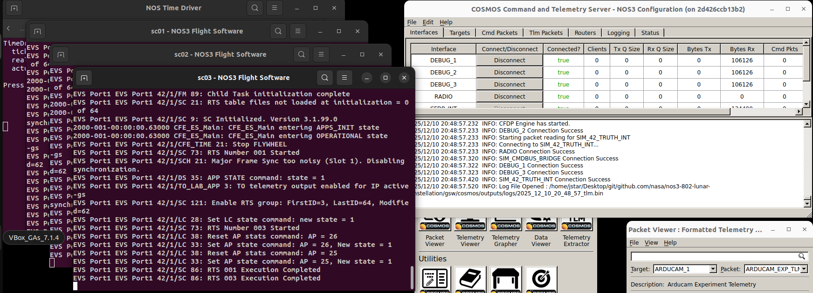
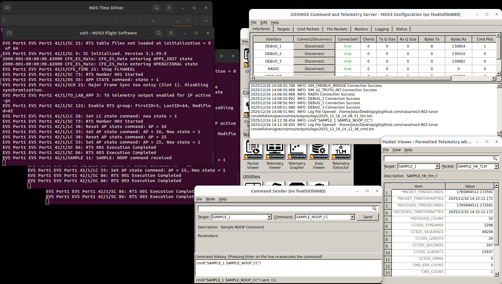
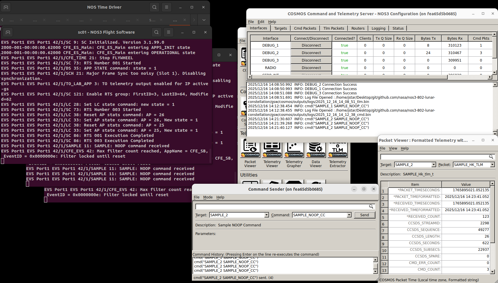
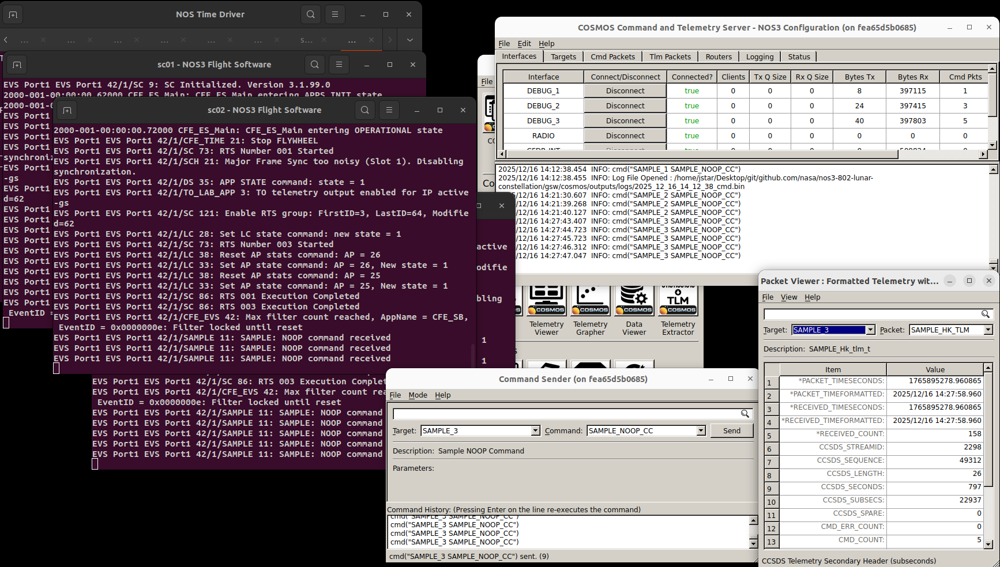
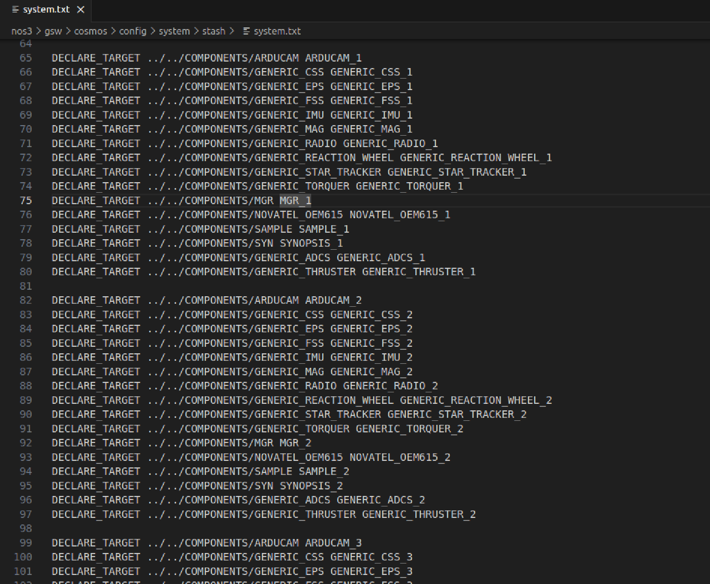
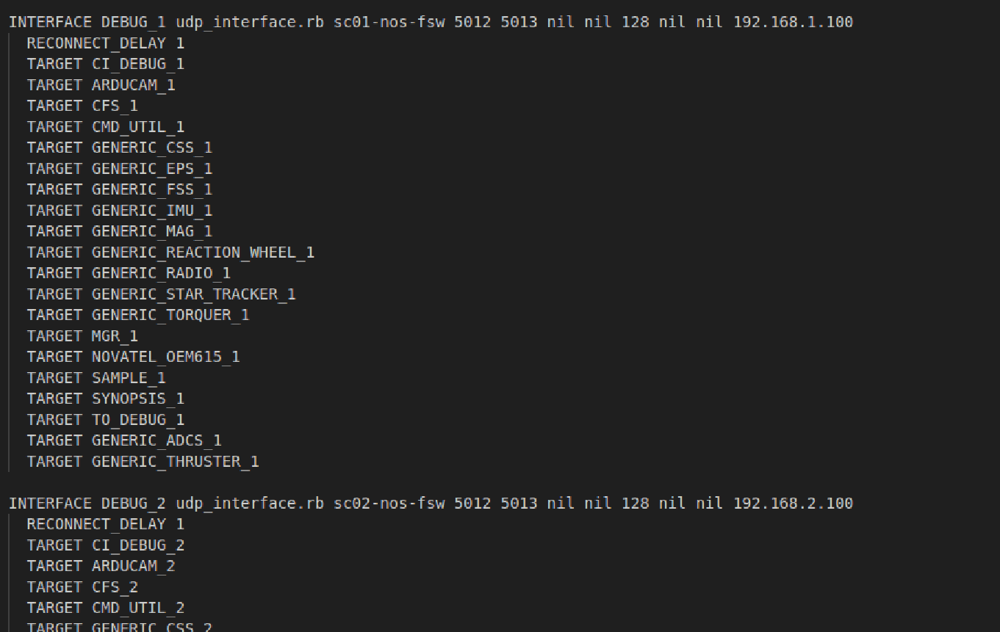

# Scenario - Constellation with Lunar Focus

This scenario was developed to demonstrate running NOS3 in a configuration which has multiple spacecraft in a constellation.
For this scenario, these spacecraft are in an orbit about the Earth-Moon L2 point.

This scenario was last updated on 06/17/2026 and leveraged the `NOS3-Multiple-Spacecraft` branch at the time [dae7e75] in the `nos3-multiple-spacecraft` repository (https://github.com/nasa-itc/nos3-multiple-spacecraft).

## Learning Goals
By the end of this scenario you should be able to:
* Command multiple spacecraft from a single ground station
* Receive telemetry from multiple spacecraft in a single ground station

## Prerequisites
Before running the scenario, complete the following steps:

* [Getting Started](./NOS3_Getting_Started.md)
  * [Installation](./NOS3_Getting_Started.md#installation)
  * [Running](./NOS3_Getting_Started.md#running)

## Walkthrough
For this scenario, you will need to switch to the `NOS3-Multiple-Spacecraft` branch in the `nos3-multiple-spacecraft` repository (https://github.com/nasa-itc/nos3-multiple-spacecraft).
For this particular scenario, you will need to run `make uninstall`, followed by `make prep`.
Once you do that, you can do a typical `make` and `make launch`.
You will notice that three flight software windows are opened with titles `sc0N - NOS3 Flight Software`, where `N` is either 1, 2, or 3.
Once you start COSMOS, you will similarly see three telemetry debug interfaces in the command and telemetry server (`DEBUG_1`, `DEBUG_2`, and `DEBUG_3`).
This is shown in the figure below.

 

You can verify that telemetry is being received by examining the `Bytes Rx` column in the COSMOS Command and Telemetry Server window.

Next we will show that we can command each of the three flight software instances.
In the Packet Viewer, select target `SAMPLE_1` and packet `SAMPLE_HK_TLM`.
The current command count `CMD_COUNT` should be 0.
Now in the Command Sender window, select target `SAMPLE_1` and command `SAMPLE_NOOP_CC`.
Click `Send` in the Command Sender window.
You should now see `SAMPLE: NOOP command received` in the `sc01 - NOS3 Flight Software` window and the `CMD_COUNT` increase to 1 in the Packet Viewer.
This is shown below:

Now verify the same command and telemetry for spacecraft 2.
Send the command `SAMPLE_NOOP_CC` to target `SAMPLE_2`, and view the `sc02 - NOS3 Flight Software` window and the Packet Viewer, with target set to `SAMPLE_2` and packet set to `SAMPLE_HK_TLM`.
Send the command three times; verify that flight software receives it three times and that the `CMD_COUNT` increases to three.
This is shown below:

Finally, verify the same thing for spacecraft 3 in the same way.
Send the command 5 times and verify that it is received five times and that the `CMD_COUNT` increases to five.
This is shown below:

Note that this is presently only in the branch mentioned above; however, the NOS3 team expects to incorporate support for multiple spacecraft into a future release.

## Background

A number of files will need to be changed to go from a base NOS3 scenario, with a single spacecraft, to a constellation scenario with a lunar focus.

These files fall into five categories:  top level configuration, 42 configuration, simulation configuration, flight software configuration, and ground software configuration.

Note all files mentioned are modified correctly in the `NOS3-Multiple-Spacecraft` branch in the following repository on github `https://github.com/nasa-itc/nos3-multiple-spacecraft`. 
Below is a description of files need modified or added for this scenario.

### Top Level Configuration
The top level configuration file that needs to be modified is `cfg/nos3-mission.xml`.
Changes that need to be made include the following:
  * First, change the `<scenario>` from "STF1" to "Gateway".
      * This will cause the scenario to use `cfg/InOut/Inp_Sim_Gateway.txt` instead of the `cfg/InOut/Inp_Sim.txt` file and `cfg/InOut/Inp_Graphics_Gateway.txt` instead of the `cfg/InOut/Inp_Graphics.txt` file for 42.
  * Next change `<number-spacecraft>` from "1" to "3".
  * Finally, add Spacecraft configuration targets like `<sc-1-cfg>`, add `<sc-2-cfg>` and `<sc-3-cfg>` with values "spacecraft/sc-mission-config.xml".

### 42 Configuration
The first change here which needs to be made is to update `cfg/InOut/Inp_Sim.txt`.  Make a backup copy of `cfg/InOut/Inp_Sim.txt` and make the following changes:
  * Line 11 should be changed to "Orb_NRHO.txt" so that the Lunar Near Rectilinear Halo Orbit (NRHO) is used as the orbit for the spacecraft, instead of its typical Earth-centered orbit.
      * Note that the file `cfg/InOut/Orb_NRHO.txt` is already provided with NOS3 and specifies a Lunar NRHO orbit.
  * Line 13 should be changed from "1" to "3" and lines 14, 15, and 16 should read "SC_Gateway.txt", "SC_Gateway2.txt", and "SC_Gateway3.txt".
      * Note that the files `cfg/InOut/SC_Gateway.txt`, `cfg/InOut/SC_Gateway2.txt`, and `cfg/InOut/SC_Gateway3.txt` are already provided with NOS3 and contain particular orbit offsets and different spacecraft models.
  * These files are also the location where parameters for spacecraft bodies or for various sensors/actuators would be changed.

Next, it is necessary to update `cfg/InOut/Inp_Graphics.txt`.
Make a backup copy of this file and make the following change:
  * The main thing to change here is line 16 to specify a reasonable POV range for the modified spacecraft model.

Finally, the file `cfg/InOut/Inp_IPC.txt` needs to be changed.
It needs to have the IPC connections added for the simulators for spacecraft 2 and 3.
This involves duplicating the 15 blocks of sensor/actuator IPC parameters for spacecraft 2 and 3, and then changing the appropriate spacecraft prefixes from "SC[0]" to "SC[1]" or "SC[2]" as appropriate.
In addition, the server ports must be changed so that they are unique and correspond to the port numbers specified in the simulation configuration files `sc-1-nos3-simulator.xml`, `sc-2-nos3-simulator.xml`, and `sc-3-nos3-simulator.xml`.
For your convenience, the file `Inp_IPC_MultipleSC.txt` has been provided with these changes already made.
Just copy this file over to `Inp_IPC.txt` to use it.

### Simulation Configuration
A `.xml` file is needed for each spacecraft.
Accordingly, for this scenario, it is necessary to create `cfg/sims/sc-1-nos3-simulator.xml`, `cfg/sims/sc-2-nos3-simulator.xml`, and `cfg/sims/sc-3-nos3-simulator.xml`, all based on `cfg/sims/nos3-simulator.xml`:
  * `cfg/sims/sc-1-nos3-simulator.xml` should be an exact copy of `cfg/sims/nos3-simulator.xml`.
  * `cfg/sims/sc-2-nos3-simulator.xml` should be a copy of `cfg/sims/nos3-simulator.xml` except that the simulator data provider ports should be changed so that they are unique and correspond to the port numbers specified in the 42 configuration file `Inp_IPC.txt`.
  * `cfg/sims/sc-3-nos3-simulator.xml` should also be a copy of `cfg/sims/nos3-simulator.xml` except that the simulator data provider ports should be changed so that they are unique and correspond to the port numbers specified in the 42 configuration file `Inp_IPC.txt`.
For your convenience, the files `sc-1-nos3-simulator.xml`, `sc-2-nos3-simulator.xml`, and `sc-3-nos3-simulator.xml` are provided with the appropriate changes already made.

### Flight Software Configuration
We will need to modify the `fsw_cfs_launch.sh` script in order to configure each spacecraft with a running flight software docker container.
Note: each container is configured the same way and is running the same cFS flight software configuration in NOS3. 

If you wish to be able to go back to a single spacecraft mode, be sure to save the original fsw_cfs_launch.sh script accordingly in your environment.
For your convenience, the file `fsw_cfs_launch_multiple_sc.sh` is provided with appropriate changes already made.
All that needs done is to copy `fsw_cfs_launch_multiple_sc.sh` to `fsw_cfs_launch.sh` to use the multiple spacecraft file.

### Ground Software Configuration
Next, it is necessary to modify Cosmos in order to include the necessary targets for each spacecraft. 

First, you will need to modify the `system.txt` file located in ` nos3/gsw/cosmos/config/system/stash`.
Add the necessary targets by duplicating the targets already in that file.
Simply duplicate the **Component** Targets 3 times, renaming each target for each spacecraft.
For example: 

Once all the targets are duplicated for the 3 Spacecraft, we will add them to the cmd_tlm_server for cosmos.

Next we modify the `cmd_tlm_server.txt` located in the file path `/nos3/gsw/cosmos/config/tools/cmd_tlm_server/stash`.
You will need to duplicate the existing target definitions 3 times for the debug interface 1, 2, and 3 respectively.
Note you will need to assign the appropriate host name of the appropriate spacecraft flight software container to each interface, and bind it to the correct IP address as defined in the CFS Launch script we modified earlier.
We do this so Cosmos can command flight software and process telemetry coming from port 5013 from 3 different containers at the same time.

