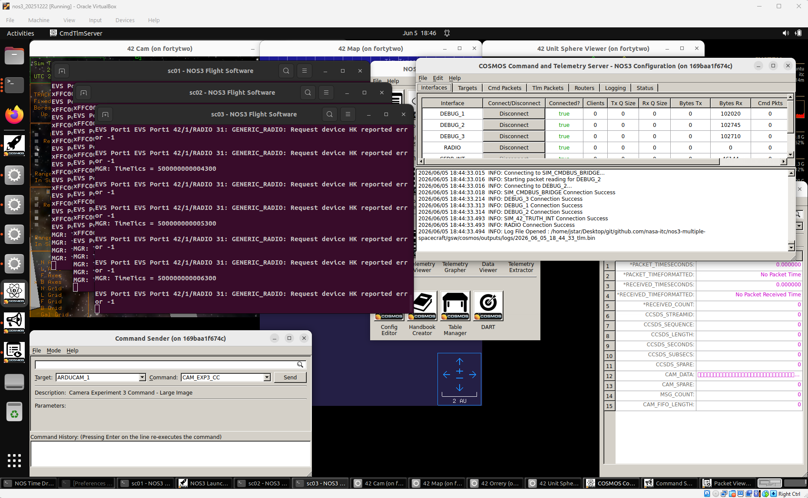
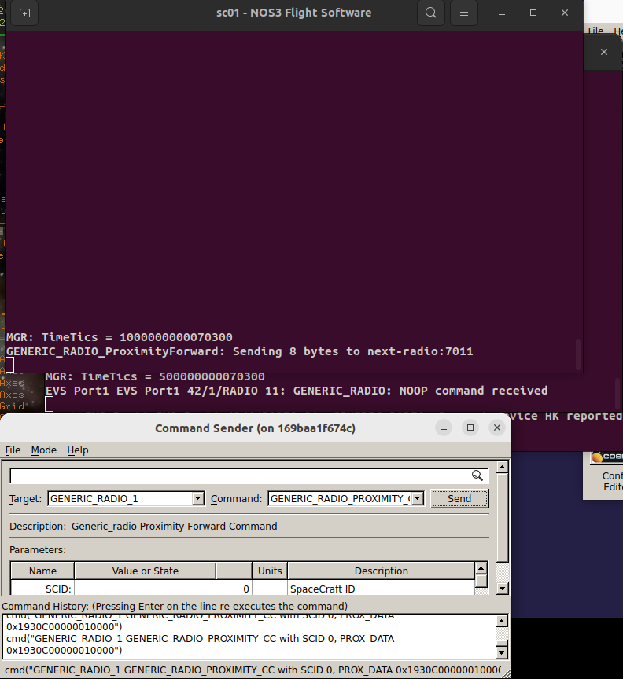

# Scenario - Multiple Spacecraft

This scenario was developed to demonstrate how to work with multiple spacecraft at once.

This scenario was last updated on 06/08/2026 and leveraged the `NOS3-Multiple-Spacecraft` branch at the time [dae7e75] in the `nos3-multiple-spacecraft` repository (https://github.com/nasa-itc/nos3-multiple-spacecraft).

## Learning Goals
By the end of this scenario you should be able to:
* Command multiple spacecraft from a single ground station.
* Receive telemetry from multiple spacecraft in a single ground station.
* Send a command to a spacecraft that is forwarded to another spacecraft.

## Prerequisites
Before running the scenario, complete the following steps:

* [Getting Started](./NOS3_Getting_Started.md)
  * [Installation](./NOS3_Getting_Started.md#installation)
  * [Running](./NOS3_Getting_Started.md#running)

You should also review the following lessons before this one:
* [STF - Quick Look](./STF_QuickLook.md)
* [Constellation with Lunar Focus](./Scenario_Constellation_with_Lunar_Focus.md)

## Walkthrough
For this scenario, you will need to switch to the `NOS3-Multiple-Spacecraft` branch in the `nos3-multiple-spacecraft` repository (https://github.com/nasa-itc/nos3-multiple-spacecraft).
For this particular scenario, you will need to run `make uninstall`, followed by `make prep`.
Once you do that, you can do a typical `make` and `make launch`.
You will notice that three flight software windows are opened with titles `sc0N - NOS3 Flight Software`, where `N` is either 1, 2, or 3.
Similarly, once you start COSMOS, you will see three telemetry debug interfaces in the command and telemetry server (`DEBUG_1`, `DEBUG_2`, and `DEBUG_3`).
This is shown in the figure below.

 

You can verify that telemetry is being received by examining the Bytes Rx column in the COSMOS Command and Telemetry Server window.

Note that commands can be sent to each flight software instance just as in the Constellation with Lunar Focus scenario.  Since the procedure is the same, it will not be repeated here.

This scenario is unique in that a command can be sent to one spacecraft which will forward it on to the next spacecraft.  This is done as follows:
* In the Command Sender window select target `GENERIC_RADIO_1` and command `GENERIC_RADIO_PROXIMITY_CC`, then press the `Send` button.  
This is shown in the figure below.

In this figure you can see the command being sent from the `Command Sender`.  In the `sc01-NOS3 Flight Software` window the `GENERIC_RADIO_ProximityForward` command is visible, and it shows that it sent 8 bytes to the next radio (sc02's radio, in this case).  Then in the window below that one, the `sc02-NOS3 Flight Software` window shows that the flight software for spacecraft 2 received a `NOOP` command. 

The command being sent in the `Command Sender` can be edited to forward a different type of command to the second radio, or a command can be sent to a different satellite to forward on.  The next radio of spacecraft 1 is spacecraft 2's radio, spacecraft 2 forwards to spacecraft 3, and spacecraft 3 completes the circle by forwarding to 1.  This will be extended automatically if more spacecraft are added.

## Background
For background on configuring a multiple spacecraft scenario, please refer to the Scenario Constellation with Lunar Focus.
