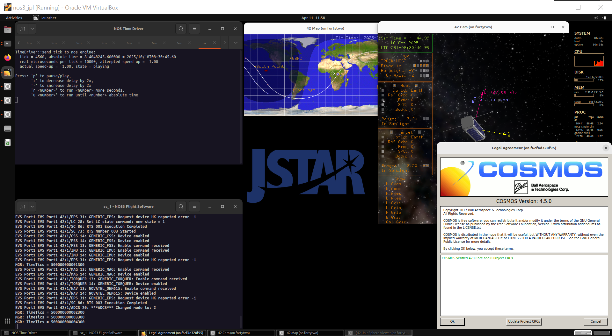
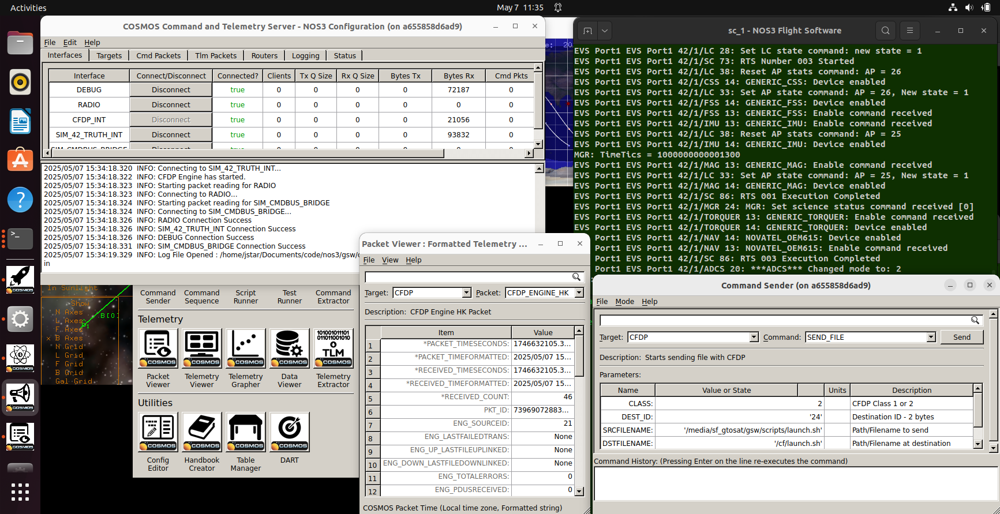

#Scenario - Patching an App or Table

This scenario was developed to explain and demonstrate the process by which a satellite operator could patch an app or table onboard a satellite, using NASA Operational Simulator for Small Satellites (NOS3).
It demonstrates the use of ground software (GSW) to go from merely commanding to sending up updated code for an app or table. 

## Learning Goals

By the end of this scenario, you should be able to:
 * Understand the use of GSW to transmit a patch to satellite FSW or tables
 * Understand the risks and pitfalls to avoid in doing so

## Prerequisites

Before running the scenario, ensure the following has been completed:
* [Getting Started](./Getting_Started.md)
  * [Installation](./Getting_Started.md#installation)
  * [Running](./Getting_Started.md#running)

It may also be helpful to have gone through the "Scenario_Nominal_Ops.md" prior to this one, as well as "Scenario_cFS.md".

## Walkthrough

Using `make launch`, launch NOS3 and open COSMOS as in previous scenarios:

Now, go to the COSMOS Command Sender and select "CFDP" in the upper-left hand corner and "SEND_FILE" to the right:

This COSMOS command allows us to send a new file from the ground station to a simulated spacecraft on orbit.  Looking into the list of parameters, one can see a path to a local file (SRCFILENAME) and to a remote, spacecraft file (DSTFILENAME). 

The other two parameters are CLASS and DEST_ID:  
 * The CLASS denotes whether to use Class 1 or Class 2 data transfers:
    * Class 1 transfers are equivalent to UDP, so any data lost is lost for good.
    * Class 2 transfers are equivalent to TCP, and use the ACK/NAK process to confirm transmission of the data.
 * Class 2 is typically preferred, and this is also true for patching the spacecraft, where a partial file could cause significant problems.  Accordingly, we will leave the CLASS parameter as 2.
 * DEST_ID determines where the data is being sent.  More specifically, it will only change when multiple spacecraft are present to receive data.  Accordingly, we will also leave it as-is.  

For those wishing to slightly extend this scenario, they may wish to try running again but with the `make cosmos-operator` command instead of `make launch`.  The former command launches all of NOS3, but only shows COSMOS (since that is all that would be seen by a spacecraft operator in a real scenario).  

