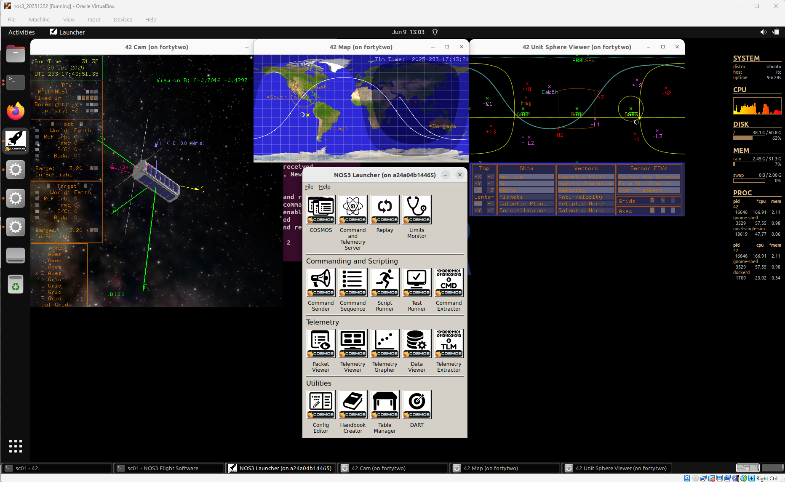
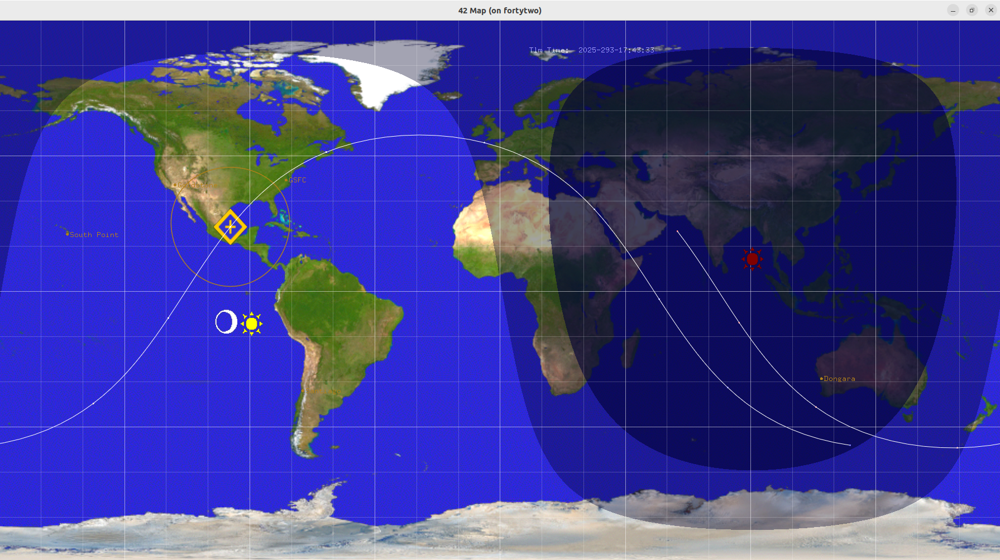
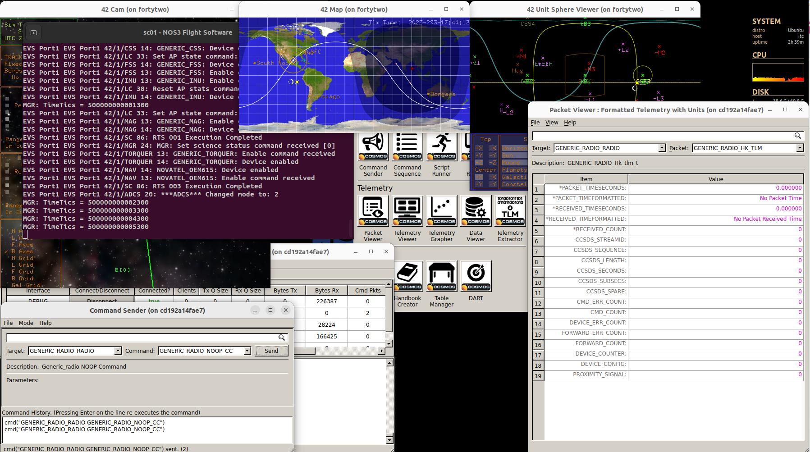
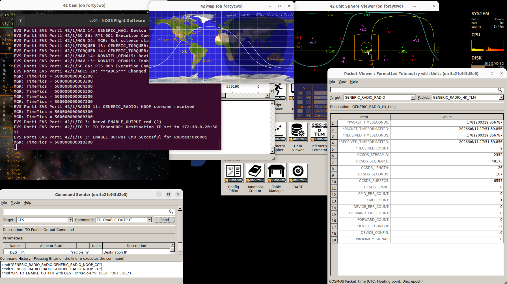
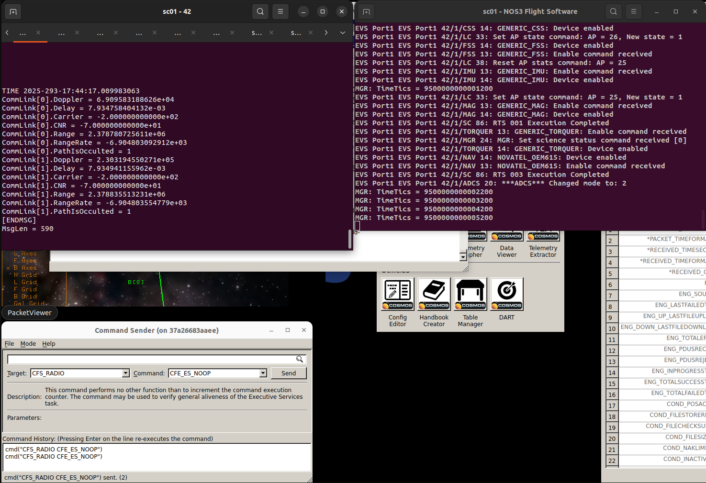
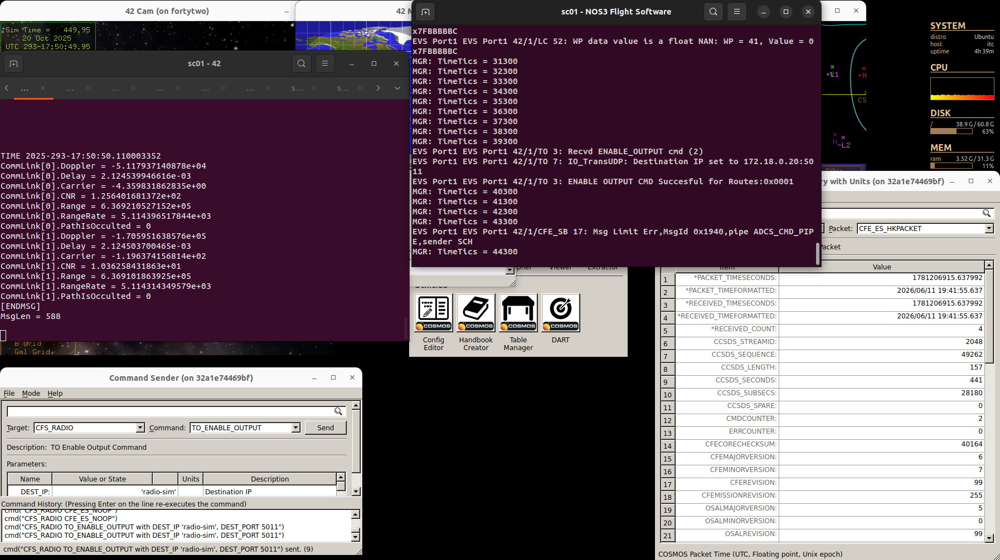
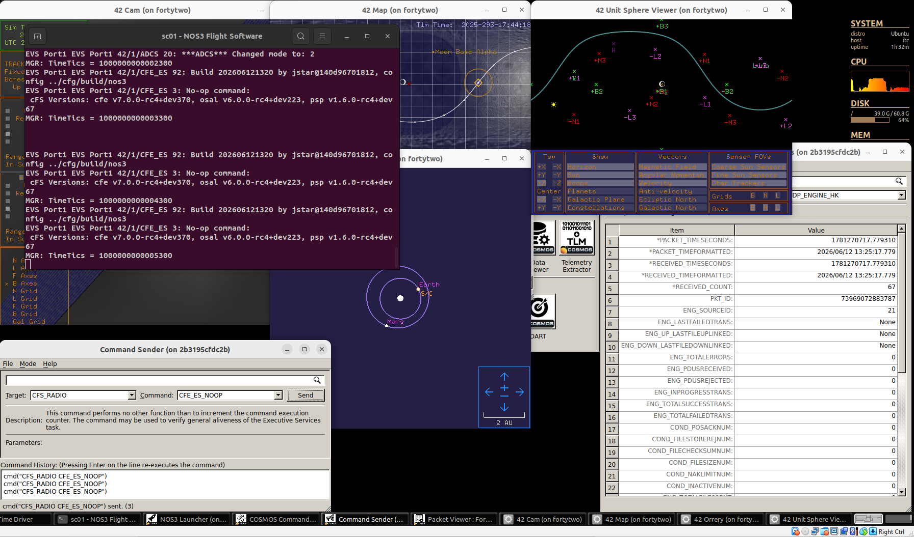

# Scenario - R/F Inviews and Delays

This scenario was developed to explain and demonstrate the following capabilities of NOS3:
 * The capability to track a satellite's progression over a ground station and limit radio contact to only times when the satellite is in view of the ground station.
 * The capability to limit communication between ground station and spacecraft based on a minimum Carrier to Noise Ratio (CNR) requirement.
 * The capability to model speed-of-light communication delays between a ground station and a spacecraft.

This scenario was last updated on 06/11/2026 and leveraged the `dev` branch at the time [`645d9bec`].

## Learning Goals

By the end of this scenario, you should be able to:
 * Set up NOS3 to restrict communications to the simulated spacecraft radio based on its location and view of the ground.
 * Set up NOS3 to restrict communications to the simulated spacecraft radio based on the Carrier to Noise Ratio (CNR).
 * Observe speed-of-light communication delays between the spacecraft radio and the ground.

## Prerequisites

Before running the scenario, complete the following steps:
* [Getting Started](./NOS3_Getting_Started.md)
  * [Installation](./NOS3_Getting_Started.md#installation)
  * [Running](./NOS3_Getting_Started.md#running)

## Walkthrough

Note that the ability of NOS3 to constrain radio functionality based on inviews or Carrier to Noise Ratio, as well as the ability to simulate light time delays, is all configurable.  By default it is configured to be off, so the first thing we need to do is to turn it on: 
 * First, navigate to the `cfg/sims/nos3-simulator` file.
 * In that file, search for the `GENERIC_RADIO_42_PROVIDER`.
 * Change the `uplink-close-criteria` and the `downlink-close-criteria` to `occulted`.
 * Also change the `uplink-delay-on` and the `downlink-delay-on` to true.

With a terminal navigated to the top level of your NOS3 repository, run make clean and make:
 * `make clean`
 * `make`

Next, launch NOS3 (using `make launch`) and open COSMOS using the `COSMOS` button in the `NOS3 Launcher` window:

Next, examine the 42 map window.  

The spacecraft position is indicated by the yellow diamond with the plus inside.
The orange circle surrounding the spacecraft represents the part of the Earth where the satellite is in view at any given moment.
In this scenario, GSFC is the ground station and it is shown as an orange dot with the GSFC label beside it.
Note that at the beginning of the scenario, the GSFC dot is not within the spacecraft's orange inview circle.

While GSFC is not in view of the satellite, try sending a `GENERIC_RADIO_NOOP_CC` command to the spacecraft, using the target `GENERIC_RADIO_RADIO`.
Note that the command does not show up in the flight software window.
The radio has filtered the command as not occurring because the satellite is not in view of the ground station.
In addition, examining the packet viewer window, we can see that for both the generic radio packets (`GENERIC_RADIO_RADIO` and `GENERIC_RADIO_HK_TLM`), no telemetry is being received.
This is because the satellite is not in view of the ground station.
These results can be seen in the figure below:

Watching the 42 Map window, we can see that GSFC comes in view of our satellite at approximately 17:44:30.
Once the inview starts, try sending the same command as before (`GENERIC_RADIO_RADIO`, `GENERIC_RADIO_NOOP_CC`).
The NOOP command is now received.  This can be seen in the `sc01 - NOS3 Flight Software` window, depicted in the figure below.
Also send the `CFS`, `TO_ENABLE_OUTPUT` command.  Once this has been done, telemetry will begin to be received to the `GENERIC_RADIO_RADIO` interface, as depicted below in `Packet Viewer` (look specifically for `GENERIC_RADIO_RADIO` and `GENERIC_RADIO_HK_TLM`):

Now run `make stop` to halt the scenario.

Next, we will demonstrate constraining the radio using the Carrier to Noise Ratio (CNR).
This is accomplished by (again) editing the `cfg/sims/nos3-simulator.xml` file:
 * In that file, search for the `GENERIC_RADIO_42_PROVIDER`.
 * Change the `uplink-close-criteria` and the `downlink-close-criteria` to `cnr`.
 * Also, edit the file `cfg/InOut/Inp_IPC.txt`.  In that file search for `Radio IPC`.  Change the `Echo to stdout` from `FALSE` to `TRUE`.
Run `make` to rebuild the scenario software, then `make launch` to launch it again.
Again, open COSMOS by using the `COSMOS` button in the `NOS3 Launcher` window.  Bring the `sc01 - 42` and `sc01 - NOS3 Flight Software` windows into view.
Now try sending the `CFE_ES_NOOP` command to the `CFS_RADIO` target.
 * Note that it does not make it through to the `sc01 - NOS3 Flight Software` window.
 * Also note that in the `sc01 - 42` window, the `CommLink[0].CNR` value is lower than the threshold value of 15 in the `cfg/sims/nos3-simulator.xml` file, which is why the command does not make it through.
To make it easier to view the constantly updating windows, time can be paused using the `p` key in the `NOS Time Driver` window.
The figure below shows these results:

Watching the `sc01 - 42` window, we can see that the `CommLink[0].CNR` value exceeds 15 at about 17:45:15.  
At this point we can send commands, but not yet receive telemetry; to see when telemetry downlink is active we watch `CommLink[1].CNR`.
Its value exceeds 15 at about 17:50:34 and we then can see telemetry start to be downlinked in the Packet Viewer.
The figure below shows these results:

Next we will observe the uplink delay modeling in the radio simulation.
To do so, we need a deep space scenario, since the delay for earth orbiting satellites is almost negligible.
First run `make stop` to terminate the current running scenario.
Next we will again modify the file `cfg/nos3-mission.xml`.
 * Change the value of `scenario` from `STF1` to `DeepSpace`.
Next run `make clean` and `make`.
Run `make launch` to start the scenario.
Use the `COSMOS` button to open COSMOS.
Bring the `sc01 - NOS3 Flight Software` window to the front.
From the `Command Sender` execute the `CFE_ES_NOOP` command on the target `CFS_RADIO`.
In the `sc01 - NOS3 Flight Software` window we see that the receipt of the command is delayed by a little over a second.  
This corresponds to the amount of time it takes light to travel from Goldstone (a ground station on Earth) to the satellite (orbiting the Moon). 
This can be seen in the figure below:

This completes the learning goals for this scenario.
